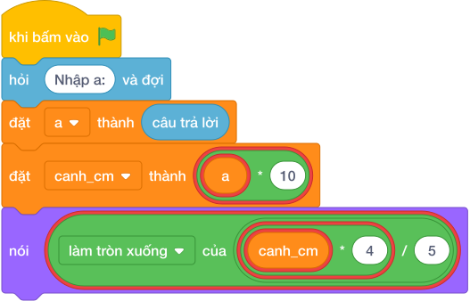

# Hướng Dẫn Giảng Dạy

## 1. Ý tưởng & Phân tích thuật toán

- Bản chất là đổi đơn vị rồi chia chu vi: với `a = 1` dm thì `canh_cm = 1 * 10 = 10` cm, chu vi `10 * 4 = 40` cm, số bóng `làm tròn xuống của (40 / 5) = 8`.
- Quy trình trong lời giải: đọc `a`, tính `canh_cm = a * 10`, rồi in `canh_cm * làm tròn xuống của (4 / 5)`; thứ tự nhân trước chia sau cho đúng.
- Xử lý biên: `a = 1` cho `8` bóng; `a = 10^7` cho `80000000` bóng; mọi đáp số đều chia hết vì `a * 40` luôn chia hết cho `5`.

---

## 2. Bảng chạy tay trên số liệu mẫu (Dry Run Table - Sample 1: 1)

| Bước | Diễn giải | Giá trị |
|------|-----------|---------|
| 1 | Đọc một dòng, biến `a` nhận giá trị | `a = 1` |
| 2 | Đổi ra xen-ti-mét `canh_cm = a * 10` | `canh_cm = 10` |
| 3 | Chu vi `canh_cm * 4` | `10 * 4 = 40` |
| 4 | Chia khoảng cách `làm tròn xuống của (40 / 5)` | `8` |
| 5 | In kết quả | `8` |

---

## 3. Lưu ý & Bẫy lỗi thường gặp

**Bẫy 1: Quên đổi dm ra cm.**

```text
a = int(hỏi và đợi)
nói (a * làm tròn xuống của (4 / 5))

```

Với số liệu mẫu trên, đoạn này cho `a = 1` in ra `0` thay vì `8` vì thiếu bước nhân `10`.

Cách sửa: tính `canh_cm = a * 10` trước.

**Bẫy 2: Dùng chia thực `/`.**

```text
nói (canh_cm * 4 / 5)

```

Với số liệu mẫu trên, đoạn này cho `a = 1` in ra `8.0` thay vì `8`.

Cách sửa: dùng `//` để ra số nguyên.

---

## 4. Lời giải tham khảo & Kịch bản Khối lệnh Scratch 3.0

### 4.1. Khối lệnh đồ họa trực quan (Visual Scratch Blocks)



> 💡 **Kịch bản thực hiện từng bước:**
> - khi bấm vào cờ xanh
> - hỏi [Nhập a:] và đợi
> - đặt [a] thành (câu trả lời)
> - đặt [canh_cm] thành (a * 10)
> - nói (canh_cm * 4 chia nguyên 5)
