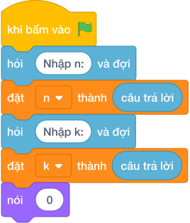

# Hướng Dẫn Giảng Dạy: Chia Kẹo Học Sinh
Chuyên đề: **Lập Trình Thuật Toán & Khối Lệnh Scratch 3.0**

---

## 1. Ý tưởng & Phân tích thuật toán

- Bản chất là chia nguyên và chia dư từ một dòng: với `n = 25`, `k = 4` thì mỗi bạn `25 // 4 = 6` chiếc, dư `25 % 4 = 1` chiếc.
- Quy trình trong lời giải: đọc một dòng `n, k = map(int, hỏi và đợi.split())`, in `n // k` ở dòng 1 rồi in `n % k` ở dòng 2.
- Xử lý biên: `n = 1, k = 1` cho `1` và `0`; khi `n < k` (ví dụ `3` và `5`) thì mỗi bạn `0` và dư `3`.

---

## 2. Bảng chạy tay trên số liệu mẫu (Dry Run Table - Sample 1: 25 4 (một dòng))

| Bước | Diễn giải | Giá trị |
|------|-----------|---------|
| 1 | Đọc một dòng, tách thành `n` và `k` | `n = 25`, `k = 4` |
| 2 | Tính `n // k` | `25 // 4 = 6` |
| 3 | In dòng 1 | `6` |
| 4 | Tính `n % k` | `25 % 4 = 1` |
| 5 | In dòng 2 | `1` |

---

## 3. Lưu ý & Bẫy lỗi thường gặp

**Bẫy 1: In hai số trên cùng một dòng.**

```text
print(n // k, n % k)
```

Với số liệu mẫu trên, đoạn này cho `25 4` in ra `6 1` trên một dòng thay vì hai dòng `6` rồi `1`.

Cách sửa: dùng hai khối lệnh `nói ()` riêng.

**Bẫy 2: Đọc hai dòng thay vì một dòng.**

```text
n = int(hỏi và đợi)
k = int(hỏi và đợi)
```

Với số liệu mẫu trên, đoạn này cho số liệu mẫu `25 4` nằm chung một dòng nên cách đọc này chờ thêm dòng và nhận sai.

Cách sửa: đọc một dòng rồi tách bằng `split()`.

---

## 4. Lời giải tham khảo & Kịch bản Khối lệnh Scratch 3.0

### 4.1. Khối lệnh đồ họa trực quan (Visual Scratch Blocks)



> 💡 **Kịch bản thực hiện từng bước:**
> - khi bấm vào cờ xanh
> - hỏi [Nhập n:] và đợi
> - đặt [n] thành (câu trả lời)
> - hỏi [Nhập k:] và đợi
> - đặt [k] thành (câu trả lời)
> - nói (0)
