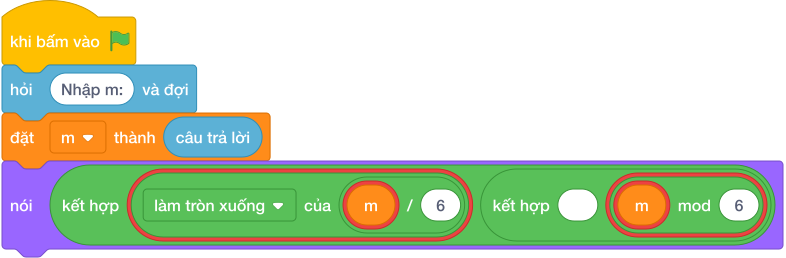

# Hướng Dẫn Giảng Dạy

## 1. Ý tưởng & Phân tích thuật toán

- Bản chất là đóng hộp 6 chiếc: với `m = 50` thì số hộp đầy `làm tròn xuống của (50 / 6) = 8`, bánh lẻ `(50 mod 6) = 2`.
- Quy trình trong lời giải: đọc `m` rồi in một dòng `nói (làm tròn xuống của (m / 6), (m mod 6))` cho ra `8 2`.
- Xử lý biên: `m = 1` cho `0 1`; `m = 6` cho `1 0`; `m = 10^6` cho `166666 4`.

---

## 2. Bảng chạy tay trên số liệu mẫu (Dry Run Table - Sample 1: 50)

| Bước | Diễn giải | Giá trị |
|------|-----------|---------|
| 1 | Đọc một dòng, biến `m` nhận giá trị | `m = 50` |
| 2 | Tính số hộp `làm tròn xuống của (m / 6)` | `làm tròn xuống của (50 / 6) = 8` |
| 3 | Tính bánh lẻ `(m mod 6)` | `(50 mod 6) = 2` |
| 4 | In một dòng hai số | `8 2` |

---

## 3. Lưu ý & Bẫy lỗi thường gặp

**Bẫy 1: In hai số xuống hai dòng.**

```text
nói (làm tròn xuống của (m / 6))
nói ((m mod 6))

```

Với số liệu mẫu trên, đoạn này cho `50` in ra `8` rồi `2` xuống hai dòng thay vì `8 2` một dòng.

Cách sửa: in chung một lệnh `nói (làm tròn xuống của (m / 6), (m mod 6))`.

**Bẫy 2: Nhầm số bánh mỗi hộp thành `5`.**

```text
nói (làm tròn xuống của (m / 5), (m mod 5))

```

Với số liệu mẫu trên, đoạn này cho `50` in ra `10 0` thay vì `8 2`.

Cách sửa: mỗi hộp đúng `6` chiếc.

---

## 4. Lời giải tham khảo & Kịch bản Khối lệnh Scratch 3.0

### 4.1. Khối lệnh đồ họa trực quan (Visual Scratch Blocks)



> 💡 **Kịch bản thực hiện từng bước:**
> - khi bấm vào cờ xanh
> - hỏi [Nhập m:] và đợi
> - đặt [m] thành (câu trả lời)
> - nói (kết hợp m chia nguyên 6 và ' ' và m mod 6)
