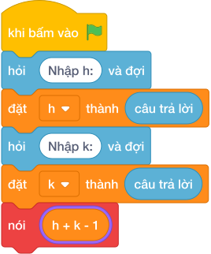

# Hướng Dẫn Giảng Dạy: Kim Đồng Hồ 12 Giờ
Chuyên đề: **Lập Trình Thuật Toán & Khối Lệnh Scratch 3.0**

---

## 1. Ý tưởng & Phân tích thuật toán

- Bản chất là đồng hồ vòng tròn 12 số: với `h = 10`, `k = 5` thì `(10 + 5 - 1) % 12 + 1 = 14 % 12 + 1 = 2 + 1 = 3`.
- Quy trình trong lời giải: đọc `h` dòng 1, đọc `k` dòng 2, trừ `1` trước khi chia dư cho `12` rồi cộng `1` để dải số chạy từ `1` đến `12` thay vì `0` đến `11`.
- Xử lý biên: `h = 12, k = 12` cho `12`; `h = 12, k = 1` cho `1`; `k = 10^9` vẫn đúng nhờ phép dư.

---

## 2. Bảng chạy tay trên số liệu mẫu (Dry Run Table - Sample 1: 10 và 5 (hai dòng))

| Bước | Diễn giải | Giá trị |
|------|-----------|---------|
| 1 | Đọc dòng 1, biến `h` nhận giá trị | `h = 10` |
| 2 | Đọc dòng 2, biến `k` nhận giá trị | `k = 5` |
| 3 | Tính `h + k - 1` | `10 + 5 - 1 = 14` |
| 4 | Tính `14 % 12 + 1` | `2 + 1 = 3` |
| 5 | In kết quả | `3` |

---

## 3. Lưu ý & Bẫy lỗi thường gặp

**Bẫy 1: Quên trừ 1 và cộng 1: `(h + k) % 12`.**

```text
print((h + k) % 12)
```

Với số liệu mẫu trên, đoạn này cho `10` và `5` cho `15 % 12 = 3` trùng đáp số nhưng với `7` và `5` cho `0` thay vì `12`.

Cách sửa: dùng `(h + k - 1) % 12 + 1`.

**Bẫy 2: Đọc hai số trên một dòng bằng `split()`.**

```text
h, k = map(int, hỏi và đợi.split())
```

Với số liệu mẫu trên, đoạn này cho số liệu mẫu mỗi số một dòng nên cách đọc này nhận thiếu `k`.

Cách sửa: đọc hai lần `hỏi và đợi` riêng.

---

## 4. Lời giải tham khảo & Kịch bản Khối lệnh Scratch 3.0

### 4.1. Khối lệnh đồ họa trực quan (Visual Scratch Blocks)



> 💡 **Kịch bản thực hiện từng bước:**
> - khi bấm vào cờ xanh
> - hỏi [Nhập h:] và đợi
> - đặt [h] thành (câu trả lời)
> - hỏi [Nhập k:] và đợi
> - đặt [k] thành (câu trả lời)
> - nói ((h + k - 1)
