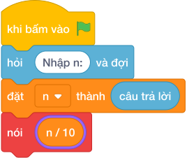

# Hướng Dẫn Giảng Dạy: Chữ Số Hàng Chục
Chuyên đề: **Lập Trình Thuật Toán & Khối Lệnh Scratch 3.0**

---

## 1. Ý tưởng & Phân tích thuật toán

- Bản chất là gọt chữ số cuối rồi lấy tận cùng: với `n = 378` thì `378 // 10 = 37`, rồi `37 % 10 = 7`.
- Quy trình trong lời giải: đọc `n` rồi in `(n // 10) % 10`; cặp ngoặc bảo đảm chia trước dư sau.
- Xử lý biên: `n = 10` cho `1`; `n = 507` cho `0`; `n = 10^9` cho `0`.

---

## 2. Bảng chạy tay trên số liệu mẫu (Dry Run Table - Sample 1: 378)

| Bước | Diễn giải | Giá trị |
|------|-----------|---------|
| 1 | Đọc một dòng, biến `n` nhận giá trị | `n = 378` |
| 2 | Bỏ chữ số cuối `n // 10` | `378 // 10 = 37` |
| 3 | Lấy tận cùng `37 % 10` | `7` |
| 4 | In kết quả | `7` |

---

## 3. Lưu ý & Bẫy lỗi thường gặp

**Bẫy 1: Chỉ lấy tận cùng `n % 10`.**

```text
print(n % 10)
```

Với số liệu mẫu trên, đoạn này cho `378` in ra `8` thay vì `7`.

Cách sửa: dùng `(n // 10) % 10`.

**Bẫy 2: Quên ngoặc, viết `n // 10 % 10` sai thứ tự trong đầu nhưng Scratch vẫn đúng — bẫy thật là `n // (10 % 10)`.**

```text
print(n // (10 % 10))
```

Với số liệu mẫu trên, đoạn này cho `378` gây lỗi chia cho `0` thay vì ra `7`.

Cách sửa: viết `(n // 10) % 10`.

---

## 4. Lời giải tham khảo & Kịch bản Khối lệnh Scratch 3.0

### 4.1. Khối lệnh đồ họa trực quan (Visual Scratch Blocks)



> 💡 **Kịch bản thực hiện từng bước:**
> - khi bấm vào cờ xanh
> - hỏi [Nhập n:] và đợi
> - đặt [n] thành (câu trả lời)
> - nói ((n  /  10)
