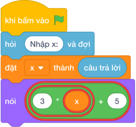

# Hướng Dẫn Giảng Dạy

## 1. Ý tưởng & Phân tích thuật toán

- Bản chất là hàm bậc nhất: với `x = 4` thì `3 * 4 + 5 = 12 + 5 = 17`.
- Quy trình trong lời giải: đọc `x` rồi in `3 * x + 5`; phép nhân thực hiện trước phép cộng theo đúng quy tắc tính.
- Xử lý biên: `x = -10^6` cho `-2999995`; `x = 10^6` cho `3000005`; `x = 0` cho `5`.

---

## 2. Bảng chạy tay trên số liệu mẫu (Dry Run Table - Sample 1: 4)

| Bước | Diễn giải | Giá trị |
|------|-----------|---------|
| 1 | Đọc một dòng, biến `x` nhận giá trị | `x = 4` |
| 2 | Tính `3 * x` | `3 * 4 = 12` |
| 3 | Cộng `5` | `12 + 5 = 17` |
| 4 | In kết quả | `17` |

---

## 3. Lưu ý & Bẫy lỗi thường gặp

**Bẫy 1: Viết `3 * (x + 5)` thêm ngoặc sai.**

```text
nói (3 * (x + 5))

```

Với số liệu mẫu trên, đoạn này cho `x = 4` cho `27` thay vì `17`.

Cách sửa: viết `3 * x + 5`.

**Bẫy 2: Viết `3 * x + 5` thiếu dấu nhân kiểu toán học `3x + 5`.**

```text
nói (3x + 5)

```

Với số liệu mẫu trên, đoạn này cho Chương trình báo lỗi cú pháp, không chạy được với `4`.

Cách sửa: luôn viết dấu `*` giữa `3` và `x`.

---

## 4. Lời giải tham khảo & Kịch bản Khối lệnh Scratch 3.0

### 4.1. Khối lệnh đồ họa trực quan (Visual Scratch Blocks)



> 💡 **Kịch bản thực hiện từng bước:**
> - khi bấm vào cờ xanh
> - hỏi [Nhập x:] và đợi
> - đặt [x] thành (câu trả lời)
> - nói (3 * x + 5)
