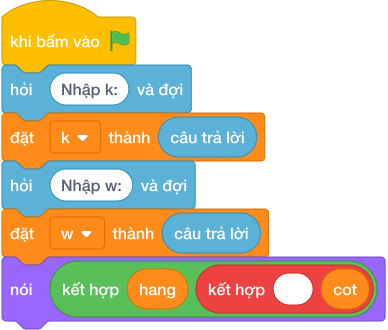

# Hướng Dẫn Giảng Dạy: Bàn Cờ Ca-rô Vô Tận
Chuyên đề: **Lập Trình Thuật Toán & Khối Lệnh Scratch 3.0**

---

## 1. Ý tưởng & Phân tích thuật toán

- Bản chất là đánh số từ `1` nên phải trừ `1` trước: với `k = 11`, `w = 4` thì hàng `(11 - 1) // 4 + 1 = 10 // 4 + 1 = 2 + 1 = 3`, cột `(11 - 1) % 4 + 1 = 10 % 4 + 1 = 2 + 1 = 3`.
- Quy trình trong lời giải: đọc `k` dòng 1, đọc `w` dòng 2, tính `hang` và `cot` theo hai công thức trên rồi in `hang cot`.
- Xử lý biên: `k = 1, w = 10^6` cho hàng `1` cột `1`; `k = 4, w = 4` cho hàng `1` cột `4`; `k = 5, w = 4` sang hàng `2` cột `1`.

---

## 2. Bảng chạy tay trên số liệu mẫu (Dry Run Table - Sample 1: 11 và 4 (hai dòng))

| Bước | Diễn giải | Giá trị |
|------|-----------|---------|
| 1 | Đọc dòng 1, biến `k` nhận giá trị | `k = 11` |
| 2 | Đọc dòng 2, biến `w` nhận giá trị | `w = 4` |
| 3 | Tính `hang = (11 - 1) // 4 + 1` | `hang = 3` |
| 4 | Tính `cot = (11 - 1) % 4 + 1` | `cot = 3` |
| 5 | In kết quả | `3 3` |

---

## 3. Lưu ý & Bẫy lỗi thường gặp

**Bẫy 1: Quên trừ 1: `k // w + 1`.**

```text
print(k // w + 1, k % w + 1)
```

Với số liệu mẫu trên, đoạn này cho `11` và `4` cho `3 4` thay vì `3 3`.

Cách sửa: dùng `(k - 1) // w + 1` và `(k - 1) % w + 1`.

**Bẫy 2: Đọc hai số một dòng bằng `split()`.**

```text
k, w = map(int, hỏi và đợi.split())
```

Với số liệu mẫu trên, đoạn này cho số liệu mẫu mỗi số một dòng nên nhận thiếu `w`.

Cách sửa: đọc hai lần `hỏi và đợi` riêng.

---

## 4. Lời giải tham khảo & Kịch bản Khối lệnh Scratch 3.0

### 4.1. Khối lệnh đồ họa trực quan (Visual Scratch Blocks)



> 💡 **Kịch bản thực hiện từng bước:**
> - khi bấm vào cờ xanh
> - hỏi [Nhập k:] và đợi
> - đặt [k] thành (câu trả lời)
> - hỏi [Nhập w:] và đợi
> - đặt [w] thành (câu trả lời)
> - nói (kết hợp hang và " " và cot)
