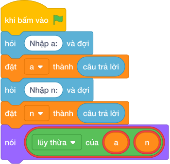

# Hướng Dẫn Giảng Dạy

## 1. Ý tưởng & Phân tích thuật toán

- Bản chất là lũy thừa tổng quát: với `a = 3`, `n = 4` thì `3 ** 4 = 81`, tức tầng cao nhất có `81` khối gỗ.
- Quy trình trong lời giải: đọc `a` dòng 1, đọc `n` dòng 2, rồi in `a ** n`.
- Xử lý biên: `n = 0` luôn cho `1` (ví dụ `10 ** 0 = 1`); `a = 1` luôn cho `1`; `a = 10, n = 10` cho `10000000000`.

---

## 2. Bảng chạy tay trên số liệu mẫu (Dry Run Table - Sample 1: 3 và 4 (hai dòng))

| Bước | Diễn giải | Giá trị |
|------|-----------|---------|
| 1 | Đọc dòng 1, biến `a` nhận giá trị | `a = 3` |
| 2 | Đọc dòng 2, biến `n` nhận giá trị | `n = 4` |
| 3 | Tính `a ** n` | `3 ** 4 = 81` |
| 4 | In kết quả | `81` |

---

## 3. Lưu ý & Bẫy lỗi thường gặp

**Bẫy 1: Dùng `a ^ n`.**

```text
nói (a ^ n)

```

Với số liệu mẫu trên, đoạn này cho `3` và `4` cho `7` thay vì `81`.

Cách sửa: toán tử mũ là `**`.

**Bẫy 2: Dùng `a * n`.**

```text
nói (a * n)

```

Với số liệu mẫu trên, đoạn này cho `3` và `4` cho `12` thay vì `81`.

Cách sửa: dùng `a ** n`.

---

## 4. Lời giải tham khảo & Kịch bản Khối lệnh Scratch 3.0

### 4.1. Khối lệnh đồ họa trực quan (Visual Scratch Blocks)



> 💡 **Kịch bản thực hiện từng bước:**
> - khi bấm vào cờ xanh
> - hỏi [Nhập a:] và đợi
> - đặt [a] thành (câu trả lời)
> - hỏi [Nhập n:] và đợi
> - đặt [n] thành (câu trả lời)
> - nói (a + n)
