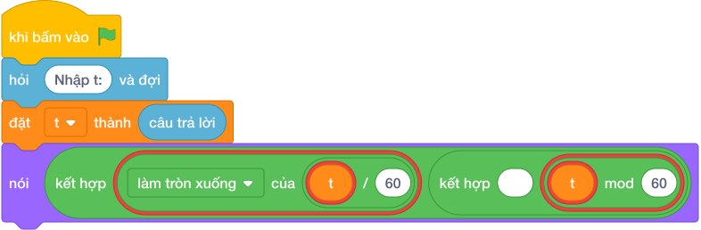

# Hướng Dẫn Giảng Dạy

## 1. Ý tưởng & Phân tích thuật toán

- Bản chất là tách giờ và phút lẻ khỏi tổng phút: với `t = 135` thì giờ `làm tròn xuống của (135 / 60) = 2`, phút dư `(135 mod 60) = 15`.
- Quy trình trong lời giải: đọc `t` rồi in một dòng `nói (làm tròn xuống của (t / 60), (t mod 60))` cho ra `2 15`.
- Xử lý biên: `t = 0` cho `0 0`; `t = 60` cho `1 0`; `t = 10000` cho `166 40`.

---

## 2. Bảng chạy tay trên số liệu mẫu (Dry Run Table - Sample 1: 135)

| Bước | Diễn giải | Giá trị |
|------|-----------|---------|
| 1 | Đọc một dòng, biến `t` nhận giá trị | `t = 135` |
| 2 | Tính giờ `làm tròn xuống của (t / 60)` | `làm tròn xuống của (135 / 60) = 2` |
| 3 | Tính phút dư `(t mod 60)` | `(135 mod 60) = 15` |
| 4 | In một dòng | `2 15` |

---

## 3. Lưu ý & Bẫy lỗi thường gặp

**Bẫy 1: Chia cho `100` thay vì `60`.**

```text
nói (làm tròn xuống của (t / 100), (t mod 100))

```

Với số liệu mẫu trên, đoạn này cho `135` cho `1 35` thay vì `2 15`.

Cách sửa: một giờ có `60` phút.

**Bẫy 2: Dùng chia thực `/`.**

```text
nói (t / 60, (t mod 60))

```

Với số liệu mẫu trên, đoạn này cho `135` in ra `2.25 15` thay vì `2 15`.

Cách sửa: dùng `//`.

---

## 4. Lời giải tham khảo & Kịch bản Khối lệnh Scratch 3.0

### 4.1. Khối lệnh đồ họa trực quan (Visual Scratch Blocks)



> 💡 **Kịch bản thực hiện từng bước:**
> - khi bấm vào cờ xanh
> - hỏi [Nhập t:] và đợi
> - đặt [t] thành (câu trả lời)
> - nói (kết hợp t chia nguyên 60 và ' ' và t mod 60)
