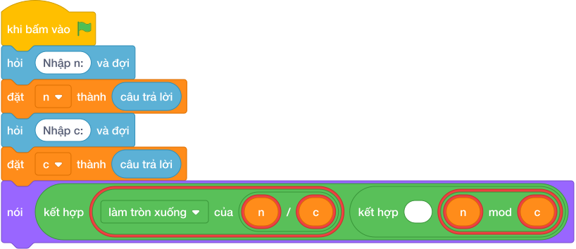

# Hướng Dẫn Giảng Dạy

## 1. Ý tưởng & Phân tích thuật toán

- Bản chất là chia tổng thời gian cho độ dài một vòng: với `n = 250`, `c = 60` thì số vòng `làm tròn xuống của (250 / 60) = 4`, phút dư `(250 mod 60) = 10`.
- Quy trình trong lời giải: đọc `n` dòng 1, đọc `c` dòng 2, rồi in `làm tròn xuống của (n / c), (n mod c)` cho ra `4 10`.
- Xử lý biên: `n = 1, c = 10^9` cho `0 1`; `n = c` cho `1 0`; `n = 10^9, c = 1` cho `1000000000 0`.

---

## 2. Bảng chạy tay trên số liệu mẫu (Dry Run Table - Sample 1: 250 và 60 (hai dòng))

| Bước | Diễn giải | Giá trị |
|------|-----------|---------|
| 1 | Đọc dòng 1, biến `n` nhận giá trị | `n = 250` |
| 2 | Đọc dòng 2, biến `c` nhận giá trị | `c = 60` |
| 3 | Tính vòng `làm tròn xuống của (n / c)` | `làm tròn xuống của (250 / 60) = 4` |
| 4 | Tính dư `(n mod c)` | `(250 mod 60) = 10` |
| 5 | In một dòng | `4 10` |

---

## 3. Lưu ý & Bẫy lỗi thường gặp

**Bẫy 1: Đọc hai số một dòng bằng `split()`.**

```text
n, c = các khối hỏi và đợi cho từng biến

```

Với số liệu mẫu trên, đoạn này cho số liệu mẫu mỗi số một dòng nên nhận thiếu `c`.

Cách sửa: đọc hai lần `hỏi và đợi` riêng.

**Bẫy 2: Hoán đổi `làm tròn xuống của (c / n)`.**

```text
nói (làm tròn xuống của (c / n), (c mod n))

```

Với số liệu mẫu trên, đoạn này cho `250` và `60` cho `0 60` thay vì `4 10`.

Cách sửa: số bị chia là `n`.

---

## 4. Lời giải tham khảo & Kịch bản Khối lệnh Scratch 3.0

### 4.1. Khối lệnh đồ họa trực quan (Visual Scratch Blocks)



> 💡 **Kịch bản thực hiện từng bước:**
> - khi bấm vào cờ xanh
> - hỏi [Nhập n:] và đợi
> - đặt [n] thành (câu trả lời)
> - hỏi [Nhập c:] và đợi
> - đặt [c] thành (câu trả lời)
> - nói (kết hợp n chia nguyên c và ' ' và n mod c)
