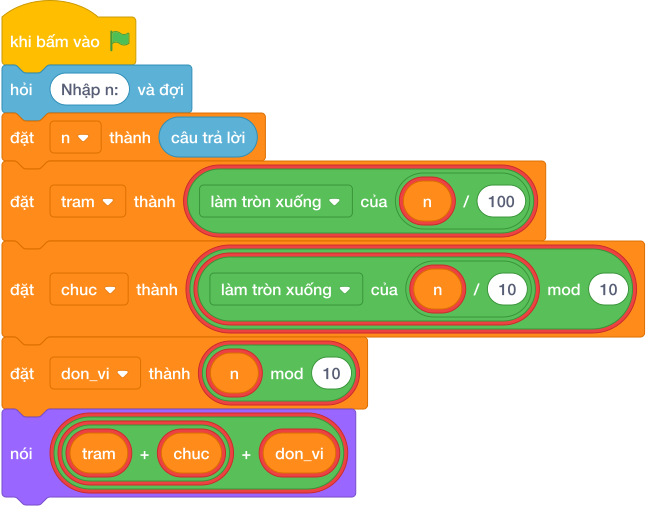

# Hướng Dẫn Giảng Dạy

## 1. Ý tưởng & Phân tích thuật toán

- Bản chất là tách ba hàng rồi cộng: với `n = 385` thì trăm `làm tròn xuống của (385 / 100) = 3`, chục `(làm tròn xuống của (385 / 10)) % 10 = (38 mod 10) = 8`, đơn vị `(385 mod 10) = 5`, tổng `3 + 8 + 5 = 16`.
- Quy trình trong lời giải: đọc `n`, đặt ba biến `tram`, `chuc`, `don_vi` rồi in tổng của chúng.
- Xử lý biên: `n = 100` cho `1`; `n = 999` cho `27`; `n = 101` cho `2`.

---

## 2. Bảng chạy tay trên số liệu mẫu (Dry Run Table - Sample 1: 385)

| Bước | Diễn giải | Giá trị |
|------|-----------|---------|
| 1 | Đọc một dòng, biến `n` nhận giá trị | `n = 385` |
| 2 | Tách `tram = làm tròn xuống của (385 / 100)` | `tram = 3` |
| 3 | Tách `chuc = (làm tròn xuống của (385 / 10)) % 10` | `chuc = 8` |
| 4 | Tách `don_vi = (385 mod 10)` | `don_vi = 5` |
| 5 | Cộng và in `3 + 8 + 5` | `16` |

---

## 3. Lưu ý & Bẫy lỗi thường gặp

**Bẫy 1: Quên tách hàng chục, chỉ cộng trăm và đơn vị.**

```text
nói (làm tròn xuống của (n / 100) + (n mod 10))

```

Với số liệu mẫu trên, đoạn này cho `385` cho `8` thay vì `16`.

Cách sửa: cộng thêm `(làm tròn xuống của (n / 10)) % 10`.

**Bẫy 2: Viết `chuc = làm tròn xuống của (n / 10) % 100`.**

```text
chuc = làm tròn xuống của (n / 10) % 100

```

Với số liệu mẫu trên, đoạn này cho `385` thì `chuc = 38` nên tổng thành `46` thay vì `16`.

Cách sửa: dùng `(làm tròn xuống của (n / 10)) % 10`.

---

## 4. Lời giải tham khảo & Kịch bản Khối lệnh Scratch 3.0

### 4.1. Khối lệnh đồ họa trực quan (Visual Scratch Blocks)



> 💡 **Kịch bản thực hiện từng bước:**
> - khi bấm vào cờ xanh
> - hỏi [Nhập n:] và đợi
> - đặt [n] thành (câu trả lời)
> - đặt [tram] thành (n chia nguyên 100)
> - đặt [chuc] thành (n chia nguyên 10 mod 10)
> - đặt [don_vi] thành (n mod 10)
> - nói (tram + chuc + don_vi)
