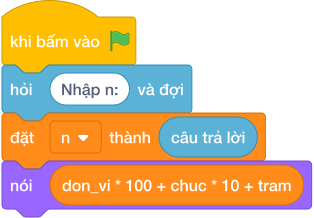

# Hướng Dẫn Giảng Dạy: Số Đảo Ngược Ba Chữ Số
Chuyên đề: **Lập Trình Thuật Toán & Khối Lệnh Scratch 3.0**

---

## 1. Ý tưởng & Phân tích thuật toán

- Bản chất là đảo vị trí trăm và đơn vị: với `n = 472` thì trăm `4`, chục `7`, đơn vị `2`, số mới `2 * 100 + 7 * 10 + 4 = 200 + 70 + 4 = 274`.
- Quy trình trong lời giải: đọc `n`, tách `tram`, `chuc`, `don_vi` rồi in `don_vi * 100 + chuc * 10 + tram`.
- Xử lý biên: `n = 100` cho `1` (vì `001` là `1`); `n = 999` cho `999`; chữ số tận cùng khác `0` nên không mất chữ số giữa.

---

## 2. Bảng chạy tay trên số liệu mẫu (Dry Run Table - Sample 1: 472)

| Bước | Diễn giải | Giá trị |
|------|-----------|---------|
| 1 | Đọc một dòng, biến `n` nhận giá trị | `n = 472` |
| 2 | Tách `tram = 472 // 100` | `tram = 4` |
| 3 | Tách `chuc = 7`, `don_vi = 2` | `chuc = 7`, `don_vi = 2` |
| 4 | Ghép `2 * 100 + 7 * 10 + 4` | `274` |
| 5 | In kết quả | `274` |

---

## 3. Lưu ý & Bẫy lỗi thường gặp

**Bẫy 1: Ghép sai thứ tự `tram * 100 + ...` (in lại số cũ).**

```text
print(tram * 100 + chuc * 10 + don_vi)
```

Với số liệu mẫu trên, đoạn này cho `472` in ra `472` thay vì `274`.

Cách sửa: đặt `don_vi` lên hàng trăm.

**Bẫy 2: Quên nhân `100`, viết `don_vi + chuc * 10 + tram`.**

```text
print(don_vi + chuc * 10 + tram)
```

Với số liệu mẫu trên, đoạn này cho `472` cho `76` thay vì `274`.

Cách sửa: `don_vi * 100`.

---

## 4. Lời giải tham khảo & Kịch bản Khối lệnh Scratch 3.0

### 4.1. Khối lệnh đồ họa trực quan (Visual Scratch Blocks)



> 💡 **Kịch bản thực hiện từng bước:**
> - khi bấm vào cờ xanh
> - hỏi [Nhập n:] và đợi
> - đặt [n] thành (câu trả lời)
> - nói (don_vi * 100 + chuc * 10 + tram)
