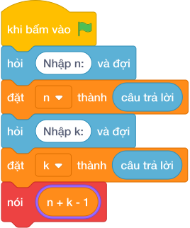

# Hướng Dẫn Giảng Dạy: Chuyến Xe Học Sinh
Chuyên đề: **Lập Trình Thuật Toán & Khối Lệnh Scratch 3.0**

---

## 1. Ý tưởng & Phân tích thuật toán

- Bản chất là làm tròn lên phép chia: với `n = 41`, `k = 10` thì `(41 + 10 - 1) // 10 = 50 // 10 = 5` xe; 4 xe chở `40` em, còn `1` em cần thêm xe thứ `5`.
- Quy trình trong lời giải: đọc một dòng `n, k`, rồi in `(n + k - 1) // k`.
- Xử lý biên: `n = 10, k = 10` cho `1`; `n = 11, k = 10` cho `2`; `n = 10^9, k = 1` cho `1000000000`.

---

## 2. Bảng chạy tay trên số liệu mẫu (Dry Run Table - Sample 1: 41 10 (một dòng))

| Bước | Diễn giải | Giá trị |
|------|-----------|---------|
| 1 | Đọc một dòng, tách `n` và `k` | `n = 41`, `k = 10` |
| 2 | Tính `n + k - 1` | `41 + 10 - 1 = 50` |
| 3 | Chia nguyên `50 // 10` | `5` |
| 4 | In kết quả | `5` |

---

## 3. Lưu ý & Bẫy lỗi thường gặp

**Bẫy 1: Dùng chia xuống `n // k`.**

```text
print(n // k)
```

Với số liệu mẫu trên, đoạn này cho `41 10` cho `4` thay vì `5`, còn `1` em bị bỏ lại.

Cách sửa: dùng `(n + k - 1) // k`.

**Bẫy 2: Dùng chia thực `/`.**

```text
print(n / k)
```

Với số liệu mẫu trên, đoạn này cho `41 10` in ra `4.1` thay vì `5`.

Cách sửa: dùng công thức làm tròn lên với `//`.

---

## 4. Lời giải tham khảo & Kịch bản Khối lệnh Scratch 3.0

### 4.1. Khối lệnh đồ họa trực quan (Visual Scratch Blocks)



> 💡 **Kịch bản thực hiện từng bước:**
> - khi bấm vào cờ xanh
> - hỏi [Nhập n:] và đợi
> - đặt [n] thành (câu trả lời)
> - hỏi [Nhập k:] và đợi
> - đặt [k] thành (câu trả lời)
> - nói ((n + k - 1)
