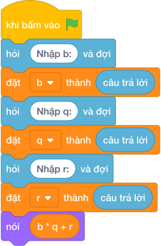

# Hướng Dẫn Giảng Dạy: Phục Hồi Số Bị Chia
Chuyên đề: **Lập Trình Thuật Toán & Khối Lệnh Scratch 3.0**

---

## 1. Ý tưởng & Phân tích thuật toán

- Bản chất là công thức phục hồi số bị chia: với `b = 6`, `q = 8`, `r = 3` thì `6 * 8 + 3 = 48 + 3 = 51` chiếc kẹo ban đầu.
- Quy trình trong lời giải: đọc một dòng `b, q, r` rồi in `b * q + r`; nhân trước cộng sau.
- Xử lý biên: `r = 0` (chia hết) thì đáp số là `b * q`; `b = 10^6, q = 10^6, r = 999999` cho `1000000999999`.

---

## 2. Bảng chạy tay trên số liệu mẫu (Dry Run Table - Sample 1: 6 8 3 (một dòng))

| Bước | Diễn giải | Giá trị |
|------|-----------|---------|
| 1 | Đọc một dòng, tách ba biến | `b = 6`, `q = 8`, `r = 3` |
| 2 | Tính `b * q` | `6 * 8 = 48` |
| 3 | Cộng `r` | `48 + 3 = 51` |
| 4 | In kết quả | `51` |

---

## 3. Lưu ý & Bẫy lỗi thường gặp

**Bẫy 1: Viết `b * (q + r)` thêm ngoặc sai.**

```text
print(b * (q + r))
```

Với số liệu mẫu trên, đoạn này cho `6 8 3` cho `66` thay vì `51`.

Cách sửa: viết `b * q + r`.

**Bẫy 2: Viết `b + q * r` nhầm vai trò.**

```text
print(b + q * r)
```

Với số liệu mẫu trên, đoạn này cho `6 8 3` cho `30` thay vì `51`.

Cách sửa: số chia `b` nhân với thương `q` rồi cộng `r`.

---

## 4. Lời giải tham khảo & Kịch bản Khối lệnh Scratch 3.0

### 4.1. Khối lệnh đồ họa trực quan (Visual Scratch Blocks)



> 💡 **Kịch bản thực hiện từng bước:**
> - khi bấm vào cờ xanh
> - hỏi [Nhập b:] và đợi
> - đặt [b] thành (câu trả lời)
> - hỏi [Nhập q:] và đợi
> - đặt [q] thành (câu trả lời)
> - hỏi [Nhập r:] và đợi
> - đặt [r] thành (câu trả lời)
> - nói (b * q + r)
