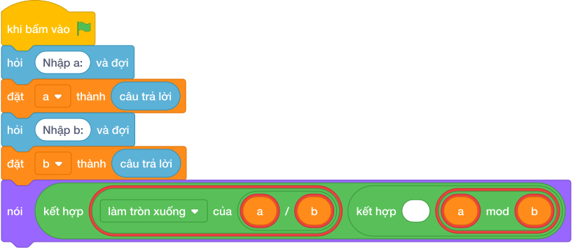

# Hướng Dẫn Giảng Dạy

## 1. Ý tưởng & Phân tích thuật toán

- Bản chất là in đồng thời thương và dư: với `a = 17`, `b = 5` thì `làm tròn xuống của (17 / 5) = 3` và `(17 mod 5) = 2`.
- Quy trình trong lời giải: đọc một dòng `a, b` rồi in một dòng `nói (làm tròn xuống của (a / b), (a mod b))` cho ra `3 2`.
- Xử lý biên: `b = a` (ví dụ `7 7`) cho `1 0`; `b = 1` thì dư luôn `0`; `a = 10^9, b = 10^9` cho `1 0`.

---

## 2. Bảng chạy tay trên số liệu mẫu (Dry Run Table - Sample 1: 17 5 (một dòng))

| Bước | Diễn giải | Giá trị |
|------|-----------|---------|
| 1 | Đọc một dòng, tách `a` và `b` | `a = 17`, `b = 5` |
| 2 | Tính `làm tròn xuống của (a / b)` | `làm tròn xuống của (17 / 5) = 3` |
| 3 | Tính `(a mod b)` | `(17 mod 5) = 2` |
| 4 | In một dòng | `3 2` |

---

## 3. Lưu ý & Bẫy lỗi thường gặp

**Bẫy 1: Dùng chia thực `/` cho thương.**

```text
nói (a / b, (a mod b))

```

Với số liệu mẫu trên, đoạn này cho `17 5` in ra `3.4 2` thay vì `3 2`.

Cách sửa: dùng `làm tròn xuống của (a / b)`.

**Bẫy 2: Hoán đổi `làm tròn xuống của (b / a)`.**

```text
nói (làm tròn xuống của (b / a), (b mod a))

```

Với số liệu mẫu trên, đoạn này cho `17 5` cho `0 5` thay vì `3 2`.

Cách sửa: số bị chia `a` đứng trước.

---

## 4. Lời giải tham khảo & Kịch bản Khối lệnh Scratch 3.0

### 4.1. Khối lệnh đồ họa trực quan (Visual Scratch Blocks)



> 💡 **Kịch bản thực hiện từng bước:**
> - khi bấm vào cờ xanh
> - hỏi [Nhập a:] và đợi
> - đặt [a] thành (câu trả lời)
> - hỏi [Nhập b:] và đợi
> - đặt [b] thành (câu trả lời)
> - nói (kết hợp a chia nguyên b và ' ' và a mod b)
