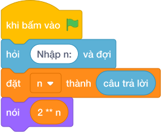

# Hướng Dẫn Giảng Dạy: Nhân Đôi Lũy Thừa
Chuyên đề: **Lập Trình Thuật Toán & Khối Lệnh Scratch 3.0**

---

## 1. Ý tưởng & Phân tích thuật toán

- Bản chất là lũy thừa của `2`: với `n = 4` thì `2 ** 4 = 16` cá thể sau `4` chu kỳ.
- Quy trình trong lời giải: đọc `n` rồi in `2 ** n`; cơ số cố định là `2`, số mũ là `n`.
- Xử lý biên: `n = 0` cho `1`; `n = 1` cho `2`; `n = 30` cho `1073741824`.

---

## 2. Bảng chạy tay trên số liệu mẫu (Dry Run Table - Sample 1: 4)

| Bước | Diễn giải | Giá trị |
|------|-----------|---------|
| 1 | Đọc một dòng, biến `n` nhận giá trị | `n = 4` |
| 2 | Tính `2 ** n` | `2 ** 4 = 16` |
| 3 | In kết quả | `16` |

---

## 3. Lưu ý & Bẫy lỗi thường gặp

**Bẫy 1: Viết `n ** 2` đảo cơ số và số mũ.**

```text
print(n ** 2)
```

Với số liệu mẫu trên, đoạn này cho `n = 4` cho `16` trùng đáp số nhưng với `n = 5` cho `25` thay vì `32`.

Cách sửa: viết `2 ** n`.

**Bẫy 2: Viết `2 ^ n`.**

```text
print(2 ^ n)
```

Với số liệu mẫu trên, đoạn này cho `n = 4` cho `6` thay vì `16`.

Cách sửa: toán tử mũ là `**`.

---

## 4. Lời giải tham khảo & Kịch bản Khối lệnh Scratch 3.0

### 4.1. Khối lệnh đồ họa trực quan (Visual Scratch Blocks)



> 💡 **Kịch bản thực hiện từng bước:**
> - khi bấm vào cờ xanh
> - hỏi [Nhập n:] và đợi
> - đặt [n] thành (câu trả lời)
> - nói (2 ** n)
