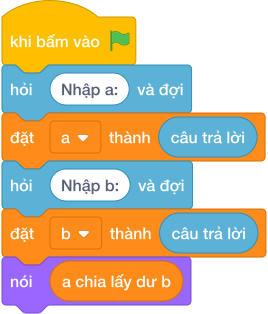

# Hướng Dẫn Giảng Dạy: Số Kẹo Còn Thừa
Chuyên đề: **Lập Trình Thuật Toán & Khối Lệnh Scratch 3.0**

---

## 1. Ý tưởng & Phân tích thuật toán

- Bản chất là phần dư không chia hết: với `a = 100`, `b = 8` thì `100 % 8 = 4` vì `100 = 12 * 8 + 4`.
- Quy trình trong lời giải: đọc `a` dòng 1, đọc `b` dòng 2, rồi in `a % b`.
- Xử lý biên: `a = 8, b = 100` cho `8`; `a` chia hết cho `b` (ví dụ `16` và `8`) cho `0`.

---

## 2. Bảng chạy tay trên số liệu mẫu (Dry Run Table - Sample 1: 100 và 8 (hai dòng))

| Bước | Diễn giải | Giá trị |
|------|-----------|---------|
| 1 | Đọc dòng 1, biến `a` nhận giá trị | `a = 100` |
| 2 | Đọc dòng 2, biến `b` nhận giá trị | `b = 8` |
| 3 | Tính `a % b` | `100 % 8 = 4` |
| 4 | In kết quả | `4` |

---

## 3. Lưu ý & Bẫy lỗi thường gặp

**Bẫy 1: In thương `a // b` thay vì dư.**

```text
print(a // b)
```


Với số liệu mẫu trên, đoạn này cho `100` và `8` cho `12` thay vì `4`.

Cách sửa: dùng `a % b`.

**Bẫy 2: Đọc hai số một dòng bằng `split()`.**

```text
a, b = map(int, hỏi và đợi.split())
```

Với số liệu mẫu trên, đoạn này cho số liệu mẫu mỗi số một dòng nên nhận thiếu `b`.

Cách sửa: đọc hai lần `hỏi và đợi` riêng.

---

## 4. Lời giải tham khảo & Kịch bản Khối lệnh Scratch 3.0

### 4.1. Khối lệnh đồ họa trực quan (Visual Scratch Blocks)



> 💡 **Kịch bản thực hiện từng bước:**
> - khi bấm vào cờ xanh
> - hỏi [Nhập a:] và đợi
> - đặt [a] thành (câu trả lời)
> - hỏi [Nhập b:] và đợi
> - đặt [b] thành (câu trả lời)
> - nói (a  chia lấy dư  b)
