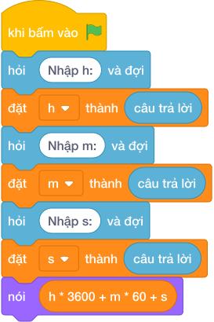

# Hướng Dẫn Giảng Dạy: Đổi Giờ Ra Phút Giây
Chuyên đề: **Lập Trình Thuật Toán & Khối Lệnh Scratch 3.0**

---

## 1. Ý tưởng & Phân tích thuật toán

- Bản chất là đổi từng đơn vị ra giây rồi cộng: với `h = 1`, `m = 20`, `s = 15` thì `1 * 3600 + 20 * 60 + 15 = 3600 + 1200 + 15 = 4815` giây.
- Quy trình trong lời giải: đọc `h`, `m`, `s` mỗi số một dòng rồi in `h * 3600 + m * 60 + s`.
- Xử lý biên: `0 0 0` cho `0`; `23 59 59` cho `86399`; `0 1 0` cho `60`.

---

## 2. Bảng chạy tay trên số liệu mẫu (Dry Run Table - Sample 1: 1, 20, 15 (ba dòng))

| Bước | Diễn giải | Giá trị |
|------|-----------|---------|
| 1 | Đọc ba dòng vào `h`, `m`, `s` | `h = 1`, `m = 20`, `s = 15` |
| 2 | Tính `h * 3600` | `3600` |
| 3 | Tính `m * 60` rồi cộng | `3600 + 1200 = 4800` |
| 4 | Cộng `s` và in | `4800 + 15 = 4815` |

---

## 3. Lưu ý & Bẫy lỗi thường gặp

**Bẫy 1: Nhầm một giờ là `360` giây.**

```text
print(h * 360 + m * 60 + s)
```

Với số liệu mẫu trên, đoạn này cho `1 20 15` cho `1575` thay vì `4815`.

Cách sửa: một giờ là `3600` giây.

**Bẫy 2: Nhầm một phút là `100` giây.**

```text
print(h * 3600 + m * 100 + s)
```

Với số liệu mẫu trên, đoạn này cho `1 20 15` cho `5615` thay vì `4815`.

Cách sửa: một phút là `60` giây.

---

## 4. Lời giải tham khảo & Kịch bản Khối lệnh Scratch 3.0

### 4.1. Khối lệnh đồ họa trực quan (Visual Scratch Blocks)



> 💡 **Kịch bản thực hiện từng bước:**
> - khi bấm vào cờ xanh
> - hỏi [Nhập h:] và đợi
> - đặt [h] thành (câu trả lời)
> - hỏi [Nhập m:] và đợi
> - đặt [m] thành (câu trả lời)
> - hỏi [Nhập s:] và đợi
> - đặt [s] thành (câu trả lời)
> - nói (h * 3600 + m * 60 + s)
