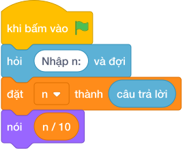

# Hướng Dẫn Giảng Dạy: Xóa Chữ Số Cuối Cùng
Chuyên đề: **Lập Trình Thuật Toán & Khối Lệnh Scratch 3.0**

---

## 1. Ý tưởng & Phân tích thuật toán

- Bản chất là cắt hàng đơn vị bằng chia nguyên cho `10`: với `n = 3458` thì `3458 // 10 = 345`.
- Quy trình trong lời giải: đọc `n` rồi in `n // 10`; một phép tính duy nhất.
- Xử lý biên: `n = 10` cho `1`; `n = 10^9 = 1000000000` cho `100000000`; số có hai chữ số luôn còn lại một chữ số.

---

## 2. Bảng chạy tay trên số liệu mẫu (Dry Run Table - Sample 1: 3458)

| Bước | Diễn giải | Giá trị |
|------|-----------|---------|
| 1 | Đọc một dòng, biến `n` nhận giá trị | `n = 3458` |
| 2 | Tính `n // 10` | `3458 // 10 = 345` |
| 3 | In kết quả | `345` |

---

## 3. Lưu ý & Bẫy lỗi thường gặp

**Bẫy 1: Dùng `% 10` (lấy chữ số cuối) thay vì xóa.**

```text
print(n % 10)
```

Với số liệu mẫu trên, đoạn này cho `3458` in ra `8` thay vì `345`.

Cách sửa: dùng `n // 10`.

**Bẫy 2: Dùng chia thực `/`.**

```text
print(n / 10)
```

Với số liệu mẫu trên, đoạn này cho `3458` in ra `345.8` thay vì `345`.

Cách sửa: dùng `//`.

---

## 4. Lời giải tham khảo & Kịch bản Khối lệnh Scratch 3.0

### 4.1. Khối lệnh đồ họa trực quan (Visual Scratch Blocks)



> 💡 **Kịch bản thực hiện từng bước:**
> - khi bấm vào cờ xanh
> - hỏi [Nhập n:] và đợi
> - đặt [n] thành (câu trả lời)
> - nói (n  /  10)
