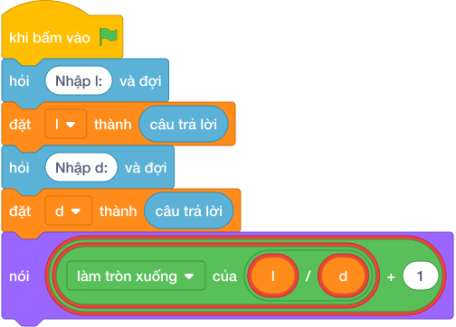

# Hướng Dẫn Giảng Dạy

## 1. Ý tưởng & Phân tích thuật toán

- Bản chất là đếm mốc chia hết cộng thêm cây ở mét `0`: với `l = 10`, `d = 3` thì `làm tròn xuống của (10 / 3) + 1 = 3 + 1 = 4` cây ở các vị trí `0, 3, 6, 9`.
- Quy trình trong lời giải: đọc `l` dòng 1 (biến tên `l`), đọc `d` dòng 2, rồi in `làm tròn xuống của (l / d) + 1`.
- Xử lý biên: `l = 3, d = 3` cho `2` cây (`0` và `3`); `l = 1, d = 10^6` cho `1` cây (chỉ cây ở `0`); `l = 10^6, d = 1` cho `1000001` cây.

---

## 2. Bảng chạy tay trên số liệu mẫu (Dry Run Table - Sample 1: 10 và 3 (hai dòng))

| Bước | Diễn giải | Giá trị |
|------|-----------|---------|
| 1 | Đọc dòng 1, biến `l` nhận giá trị | `l = 10` |
| 2 | Đọc dòng 2, biến `d` nhận giá trị | `d = 3` |
| 3 | Tính `làm tròn xuống của (l / d)` | `làm tròn xuống của (10 / 3) = 3` |
| 4 | Cộng cây ở mét `0` | `3 + 1 = 4` |
| 5 | In kết quả | `4` |

---

## 3. Lưu ý & Bẫy lỗi thường gặp

**Bẫy 1: Quên cộng cây ở mét `0`: chỉ `làm tròn xuống của (l / d)`.**

```text
nói (làm tròn xuống của (l / d))

```

Với số liệu mẫu trên, đoạn này cho `10` và `3` cho `3` thay vì `4`.

Cách sửa: cộng thêm `1`.

**Bẫy 2: Đọc hai số một dòng bằng `split()`.**

```text
l, d = các khối hỏi và đợi cho từng biến

```

Với số liệu mẫu trên, đoạn này cho số liệu mẫu mỗi số một dòng nên nhận thiếu `d`.

Cách sửa: đọc hai lần `hỏi và đợi` riêng.

---

## 4. Lời giải tham khảo & Kịch bản Khối lệnh Scratch 3.0

### 4.1. Khối lệnh đồ họa trực quan (Visual Scratch Blocks)



> 💡 **Kịch bản thực hiện từng bước:**
> - khi bấm vào cờ xanh
> - hỏi [Nhập l:] và đợi
> - đặt [l] thành (câu trả lời)
> - hỏi [Nhập d:] và đợi
> - đặt [d] thành (câu trả lời)
> - nói (l chia nguyên d + 1)
