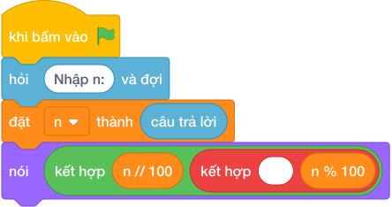

# Hướng Dẫn Giảng Dạy: Vòng Chạy Điền Kinh
Chuyên đề: **Lập Trình Thuật Toán & Khối Lệnh Scratch 3.0**

---

## 1. Ý tưởng & Phân tích thuật toán

- Bản chất là chia quãng đường cho chu vi `100` mét: với `n = 250` thì vòng trọn `250 // 100 = 2`, vị trí dư `250 % 100 = 50` mét.
- Quy trình trong lời giải: đọc `n` rồi in một dòng `nói (n // 100, n % 100)` cho ra `2 50`.
- Xử lý biên: `n = 100` cho `1 0` (vừa tròn một vòng, đứng đúng vạch xuất phát); `n = 1` cho `0 1`; `n = 10^9` cho `10000000 0`.

---

## 2. Bảng chạy tay trên số liệu mẫu (Dry Run Table - Sample 1: 250)

| Bước | Diễn giải | Giá trị |
|------|-----------|---------|
| 1 | Đọc một dòng, biến `n` nhận giá trị | `n = 250` |
| 2 | Tính vòng `n // 100` | `250 // 100 = 2` |
| 3 | Tính vị trí `n % 100` | `250 % 100 = 50` |
| 4 | In một dòng | `2 50` |

---

## 3. Lưu ý & Bẫy lỗi thường gặp

**Bẫy 1: Nhầm chu vi thành `60` (đổi phút).**

```text
print(n // 60, n % 60)
```

Với số liệu mẫu trên, đoạn này cho `250` cho `4 10` thay vì `2 50`.

Cách sửa: chu vi sân là `100` mét.

**Bẫy 2: Dùng chia thực `/`.**

```text
print(n / 100, n % 100)
```

Với số liệu mẫu trên, đoạn này cho `250` in ra `2.5 50` thay vì `2 50`.

Cách sửa: dùng `//`.

---

## 4. Lời giải tham khảo & Kịch bản Khối lệnh Scratch 3.0

### 4.1. Khối lệnh đồ họa trực quan (Visual Scratch Blocks)



> 💡 **Kịch bản thực hiện từng bước:**
> - khi bấm vào cờ xanh
> - hỏi [Nhập n:] và đợi
> - đặt [n] thành (câu trả lời)
> - nói (kết hợp n // 100 và " " và n % 100)
