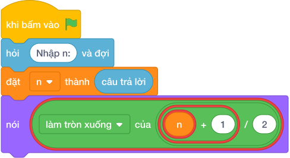

# Hướng Dẫn Giảng Dạy

## 1. Ý tưởng & Phân tích thuật toán

- Bản chất là mỗi bàn ngồi `2` bạn, bạn lẻ vẫn cần một bàn: với `n = 15` thì `(15 + 1) // 2 = làm tròn xuống của (16 / 2) = 8` bàn; `7` bàn đầy và `1` bàn cho bạn còn lại.
- Quy trình trong lời giải: đọc `n` rồi in `(n + 1) // 2`.
- Xử lý biên: `n = 1` cho `1`; `n = 2` cho `1`; `n = 10^6` (chẵn) cho `500000`.

---

## 2. Bảng chạy tay trên số liệu mẫu (Dry Run Table - Sample 1: 15)

| Bước | Diễn giải | Giá trị |
|------|-----------|---------|
| 1 | Đọc một dòng, biến `n` nhận giá trị | `n = 15` |
| 2 | Tính `n + 1` | `15 + 1 = 16` |
| 3 | Chia nguyên `làm tròn xuống của (16 / 2)` | `8` |
| 4 | In kết quả | `8` |

---

## 3. Lưu ý & Bẫy lỗi thường gặp

**Bẫy 1: Dùng `làm tròn xuống của (n / 2)` (bỏ bạn lẻ).**

```text
nói (làm tròn xuống của (n / 2))

```

Với số liệu mẫu trên, đoạn này cho `15` cho `7` thay vì `8`, còn `1` bạn không có chỗ.

Cách sửa: dùng `(n + 1) // 2`.

**Bẫy 2: Dùng chia thực `n / 2`.**

```text
nói (n / 2)

```

Với số liệu mẫu trên, đoạn này cho `15` in ra `7.5` thay vì `8`.

Cách sửa: dùng công thức làm tròn lên với `//`.

---

## 4. Lời giải tham khảo & Kịch bản Khối lệnh Scratch 3.0

### 4.1. Khối lệnh đồ họa trực quan (Visual Scratch Blocks)



> 💡 **Kịch bản thực hiện từng bước:**
> - khi bấm vào cờ xanh
> - hỏi [Nhập n:] và đợi
> - đặt [n] thành (câu trả lời)
> - nói (n + 1 chia nguyên 2)
