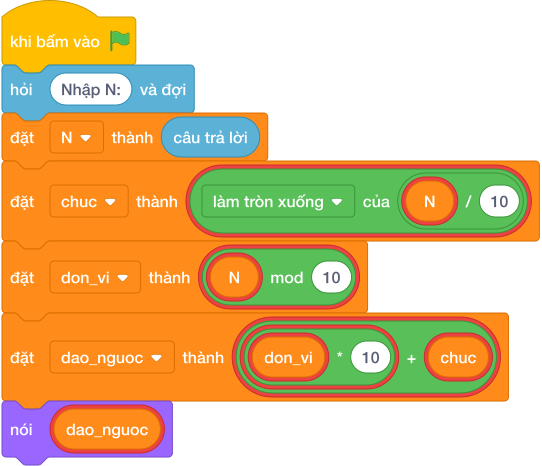

# Hướng Dẫn Giảng Dạy

## 1. Ý tưởng & Phân tích thuật toán

- Bản chất là đổi chỗ hàng chục và đơn vị: với `N = 49` thì `chuc = làm tròn xuống của (49 / 10) = 4`, `don_vi = (49 mod 10) = 9`, số đảo `9 * 10 + 4 = 90 + 4 = 94`.
- Quy trình trong lời giải: đọc `N`, đặt `chuc` và `don_vi`, tính `dao_nguoc = don_vi * 10 + chuc` rồi in ra.
- Xử lý biên: `N = 10` cho `1` (vì `01` là `1`); `N = 99` cho `99`; `N = 30` cho `3`.

---

## 2. Bảng chạy tay trên số liệu mẫu (Dry Run Table - Sample 1: 49)

| Bước | Diễn giải | Giá trị |
|------|-----------|---------|
| 1 | Đọc một dòng, biến `N` nhận giá trị | `N = 49` |
| 2 | Tách `chuc = làm tròn xuống của (49 / 10)` | `chuc = 4` |
| 3 | Tách `don_vi = (49 mod 10)` | `don_vi = 9` |
| 4 | Ghép `9 * 10 + 4` | `94` |
| 5 | In kết quả | `94` |

---

## 3. Lưu ý & Bẫy lỗi thường gặp

**Bẫy 1: Ghép sai `chuc * 10 + don_vi` (in lại số cũ).**

```text
dao_nguoc = chuc * 10 + don_vi

```

Với số liệu mẫu trên, đoạn này cho `49` cho `49` thay vì `94`.

Cách sửa: đặt `don_vi * 10 + chuc`.

**Bẫy 2: Viết biến thường `n` thay vì `N` nhưng dùng lẫn lộn.**

```text
chuc = làm tròn xuống của (n / 10)

```

Với số liệu mẫu trên, đoạn này cho Chương trình báo lỗi vì biến đã đặt tên là `N` viết hoa.

Cách sửa: giữ đúng tên `N` viết hoa như lời giải.

---

## 4. Lời giải tham khảo & Kịch bản Khối lệnh Scratch 3.0

### 4.1. Khối lệnh đồ họa trực quan (Visual Scratch Blocks)



> 💡 **Kịch bản thực hiện từng bước:**
> - khi bấm vào cờ xanh
> - hỏi [Nhập N:] và đợi
> - đặt [N] thành (câu trả lời)
> - đặt [chuc] thành (N chia nguyên 10)
> - đặt [don_vi] thành (N mod 10)
> - đặt [dao_nguoc] thành (don_vi * 10 + chuc)
> - nói (dao_nguoc)
