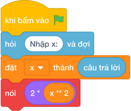

# Hướng Dẫn Giảng Dạy: Đa Thức Bậc Hai
Chuyên đề: **Lập Trình Thuật Toán & Khối Lệnh Scratch 3.0**

---

## 1. Ý tưởng & Phân tích thuật toán

- Bản chất là thay `x` vào đa thức `2x^2 - 4x + 9`: với `x = 3` thì `2 * 9 - 4 * 3 + 9 = 18 - 12 + 9 = 15`.
- Quy trình trong lời giải: đọc `x` rồi in `2 * (x ** 2) - 4 * x + 9`; cặp ngoặc `(x ** 2)` bảo đảm tính mũ trước.
- Xử lý biên: `x = 0` cho `9`; `x = -1000` cho `2004009`; `x = 1000` cho `1996009`.

---

## 2. Bảng chạy tay trên số liệu mẫu (Dry Run Table - Sample 1: 3)

| Bước | Diễn giải | Giá trị |
|------|-----------|---------|
| 1 | Đọc một dòng, biến `x` nhận giá trị | `x = 3` |
| 2 | Tính `x ** 2` | `9` |
| 3 | Tính `2 * 9 - 4 * 3 + 9` | `18 - 12 + 9 = 15` |
| 4 | In kết quả | `15` |

---

## 3. Lưu ý & Bẫy lỗi thường gặp

**Bẫy 1: Viết `2 * x ** 2` mà tưởng sai — bẫy thật là viết `2 * (x * 2)`.**

```text
print(2 * (x * 2) - 4 * x + 9)
```

Với số liệu mẫu trên, đoạn này cho `x = 3` cho `9` thay vì `15`.

Cách sửa: bình phương là `x ** 2`.

**Bẫy 2: Quên dấu trừ, viết `2 * (x ** 2) + 4 * x + 9`.**

```text
print(2 * (x ** 2) + 4 * x + 9)
```

Với số liệu mẫu trên, đoạn này cho `x = 3` cho `39` thay vì `15`.

Cách sửa: giữa là `- 4 * x`.

---

## 4. Lời giải tham khảo & Kịch bản Khối lệnh Scratch 3.0

### 4.1. Khối lệnh đồ họa trực quan (Visual Scratch Blocks)



> 💡 **Kịch bản thực hiện từng bước:**
> - khi bấm vào cờ xanh
> - hỏi [Nhập x:] và đợi
> - đặt [x] thành (câu trả lời)
> - nói (2 * (x ** 2)
