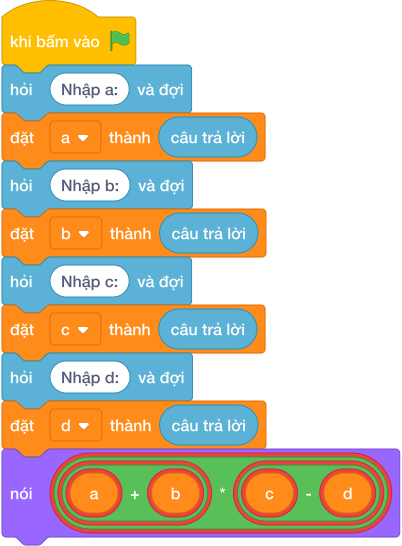

# Hướng Dẫn Giảng Dạy

## 1. Ý tưởng & Phân tích thuật toán

- Bản chất là nhân hai ngoặc: với `a = 5, b = 3, c = 10, d = 6` thì `(5 + 3) * (10 - 6) = 8 * 4 = 32`.
- Quy trình trong lời giải: đọc một dòng `a, b, c, d` rồi in `(a + b) * (c - d)`; ngoặc buộc tính tổng và hiệu trước.
- Xử lý biên: `a + b = 0` thì đáp số `0`; `c - d = 0` thì đáp số `0`; số âm vẫn đúng (ví dụ `-5 3 10 6` cho `-8`).

---

## 2. Bảng chạy tay trên số liệu mẫu (Dry Run Table - Sample 1: 5 3 10 6 (một dòng))

| Bước | Diễn giải | Giá trị |
|------|-----------|---------|
| 1 | Đọc một dòng, tách bốn biến | `a = 5`, `b = 3`, `c = 10`, `d = 6` |
| 2 | Tính `a + b` | `8` |
| 3 | Tính `c - d` | `4` |
| 4 | Nhân và in `8 * 4` | `32` |

---

## 3. Lưu ý & Bẫy lỗi thường gặp

**Bẫy 1: Bỏ ngoặc: `a + b * c - d`.**

```text
nói (a + b * c - d)

```

Với số liệu mẫu trên, đoạn này cho `5 3 10 6` cho `29` thay vì `32` vì nhân làm trước.

Cách sửa: giữ ngoặc `(a + b) * (c - d)`.

**Bẫy 2: Nhầm dấu `c + d` thay vì `c - d`.**

```text
nói ((a + b) * (c + d))

```

Với số liệu mẫu trên, đoạn này cho `5 3 10 6` cho `128` thay vì `32`.

Cách sửa: ngoặc sau là `(c - d)`.

---

## 4. Lời giải tham khảo & Kịch bản Khối lệnh Scratch 3.0

### 4.1. Khối lệnh đồ họa trực quan (Visual Scratch Blocks)



> 💡 **Kịch bản thực hiện từng bước:**
> - khi bấm vào cờ xanh
> - hỏi [Nhập a:] và đợi
> - đặt [a] thành (câu trả lời)
> - hỏi [Nhập b:] và đợi
> - đặt [b] thành (câu trả lời)
> - hỏi [Nhập c:] và đợi
> - đặt [c] thành (câu trả lời)
> - hỏi [Nhập d:] và đợi
> - đặt [d] thành (câu trả lời)
> - nói (a + b * c - d)
