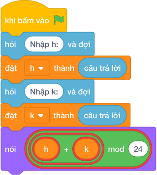

# Hướng Dẫn Giảng Dạy

## 1. Ý tưởng & Phân tích thuật toán

- Bản chất là đồng hồ quay vòng `24` giờ: với `h = 20`, `k = 10` thì `(20 + 10) % 24 = (30 mod 24) = 6` giờ sáng.
- Quy trình trong lời giải: đọc một dòng `h, k` rồi in `(h + k) % 24`.
- Xử lý biên: `h = 0, k = 0` cho `0`; `h = 23, k = 1` cho `0`; `k = 10^9` vẫn đúng nhờ phép dư.

---

## 2. Bảng chạy tay trên số liệu mẫu (Dry Run Table - Sample 1: 20 10 (một dòng))

| Bước | Diễn giải | Giá trị |
|------|-----------|---------|
| 1 | Đọc một dòng, tách `h` và `k` | `h = 20`, `k = 10` |
| 2 | Tính `h + k` | `30` |
| 3 | Tính `(30 mod 24)` | `6` |
| 4 | In kết quả | `6` |

---

## 3. Lưu ý & Bẫy lỗi thường gặp

**Bẫy 1: Quên `% 24`, chỉ `h + k`.**

```text
nói (h + k)

```

Với số liệu mẫu trên, đoạn này cho `20 10` in ra `30` thay vì `6`, vượt khung `0` đến `23`.

Cách sửa: lấy `(h + k) % 24`.

**Bẫy 2: Nhầm vòng `12` giờ (`% 12`).**

```text
nói ((h + k) % 12)

```

Với số liệu mẫu trên, đoạn này cho `20 10` cho `6` trùng đáp số nhưng với `12 12` cho `0` thay vì `0` — ví dụ `5 5` cho `10` đúng nhưng `13 0` cho `1` thay vì `13`.

Cách sửa: đồng hồ này vòng `24`.

---

## 4. Lời giải tham khảo & Kịch bản Khối lệnh Scratch 3.0

### 4.1. Khối lệnh đồ họa trực quan (Visual Scratch Blocks)



> 💡 **Kịch bản thực hiện từng bước:**
> - khi bấm vào cờ xanh
> - hỏi [Nhập h:] và đợi
> - đặt [h] thành (câu trả lời)
> - hỏi [Nhập k:] và đợi
> - đặt [k] thành (câu trả lời)
> - nói (h + k mod 24)
