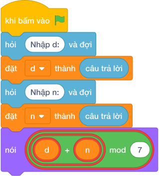

# Hướng Dẫn Giảng Dạy

## 1. Ý tưởng & Phân tích thuật toán

- Bản chất là tuần quay vòng `7` ngày: với `d = 1` (thứ Hai), `n = 10` thì `(1 + 10) % 7 = (11 mod 7) = 4` tức thứ Năm.
- Quy trình trong lời giải: đọc một dòng `d, n` rồi in `(d + n) % 7`.
- Xử lý biên: `d = 0, n = 0` cho `0` (Chủ Nhật); `d = 6, n = 1` cho `0`; `n = 10^9` vẫn đúng nhờ phép dư.

---

## 2. Bảng chạy tay trên số liệu mẫu (Dry Run Table - Sample 1: 1 10 (một dòng))

| Bước | Diễn giải | Giá trị |
|------|-----------|---------|
| 1 | Đọc một dòng, tách `d` và `n` | `d = 1`, `n = 10` |
| 2 | Tính `d + n` | `11` |
| 3 | Tính `(11 mod 7)` | `4` |
| 4 | In kết quả | `4` |

---

## 3. Lưu ý & Bẫy lỗi thường gặp

**Bẫy 1: Quên `% 7`, chỉ `d + n`.**

```text
nói (d + n)

```

Với số liệu mẫu trên, đoạn này cho `1 10` in ra `11` thay vì `4`, vượt khung `0` đến `6`.

Cách sửa: lấy `(d + n) % 7`.

**Bẫy 2: Nhầm vòng `% 24` (đồng hồ).**

```text
nói ((d + n) % 24)

```

Với số liệu mẫu trên, đoạn này cho `1 10` cho `11` thay vì `4`.

Cách sửa: tuần có `7` ngày.

---

## 4. Lời giải tham khảo & Kịch bản Khối lệnh Scratch 3.0

### 4.1. Khối lệnh đồ họa trực quan (Visual Scratch Blocks)



> 💡 **Kịch bản thực hiện từng bước:**
> - khi bấm vào cờ xanh
> - hỏi [Nhập d:] và đợi
> - đặt [d] thành (câu trả lời)
> - hỏi [Nhập n:] và đợi
> - đặt [n] thành (câu trả lời)
> - nói (d + n mod 7)
