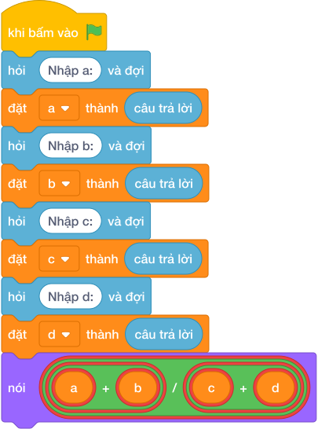

# Hướng Dẫn Giảng Dạy

## 1. Ý tưởng & Phân tích thuật toán

- Bản chất là chia thực hai tổng rồi làm tròn `2` chữ số: với `a = 7, b = 8, c = 2, d = 3` thì `(7 + 8) / (2 + 3) = 15 / 5 = 3.0`, in ra `3.00`.
- Quy trình trong lời giải: đọc một dòng `a, b, c, d` rồi in `f"{(a + b) / (c + d):.2f}"`; dùng `/` (chia thực) và định dạng `:.2f`.
- Xử lý biên: tổng mẫu khác `0` theo đề; `1 1 1 3` cho `0.50`; kết quả luôn có đúng `2` chữ số sau dấu chấm.

---

## 2. Bảng chạy tay trên số liệu mẫu (Dry Run Table - Sample 1: 7 8 2 3 (một dòng))

| Bước | Diễn giải | Giá trị |
|------|-----------|---------|
| 1 | Đọc một dòng, tách bốn biến | `a = 7`, `b = 8`, `c = 2`, `d = 3` |
| 2 | Tính tử `a + b` | `15` |
| 3 | Tính mẫu `c + d` | `5` |
| 4 | Chia `15 / 5` và làm tròn `2` chữ số | `3.00` |
| 5 | In kết quả | `3.00` |

---

## 3. Lưu ý & Bẫy lỗi thường gặp

**Bẫy 1: Dùng chia nguyên `//`.**

```text
nói (f"{(a + b) // (c + d):.2f}")

```

Với số liệu mẫu trên, đoạn này cho `7 8 2 3` cho `3` rồi định dạng thành `3` (lỗi kiểu) hoặc mất phần lẻ với số liệu khác như `1 1 1 3` cho `0.00` thay vì `0.50`.

Cách sửa: dùng `/` chia thực.

**Bẫy 2: Quên làm tròn, chỉ `nói ((a + b) / (c + d))`.**

```text
nói ((a + b) / (c + d))

```

Với số liệu mẫu trên, đoạn này cho `7 8 2 3` in ra `3.0` thay vì `3.00`, thiếu một chữ số `0`.

Cách sửa: dùng `f"{...:.2f}"`.

**Bẫy 3: Bỏ ngoặc: `a + b / c + d`.**

```text
nói (f"{a + b / c + d:.2f}")

```

Với số liệu mẫu trên, đoạn này cho `7 8 2 3` cho `12.00` thay vì `3.00`.

Cách sửa: giữ ngoặc `(a + b) / (c + d)`.

---

## 4. Lời giải tham khảo & Kịch bản Khối lệnh Scratch 3.0

### 4.1. Khối lệnh đồ họa trực quan (Visual Scratch Blocks)



> 💡 **Kịch bản thực hiện từng bước:**
> - khi bấm vào cờ xanh
> - hỏi [Nhập a:] và đợi
> - đặt [a] thành (câu trả lời)
> - hỏi [Nhập b:] và đợi
> - đặt [b] thành (câu trả lời)
> - hỏi [Nhập c:] và đợi
> - đặt [c] thành (câu trả lời)
> - hỏi [Nhập d:] và đợi
> - đặt [d] thành (câu trả lời)
> - nói (giá trị)
