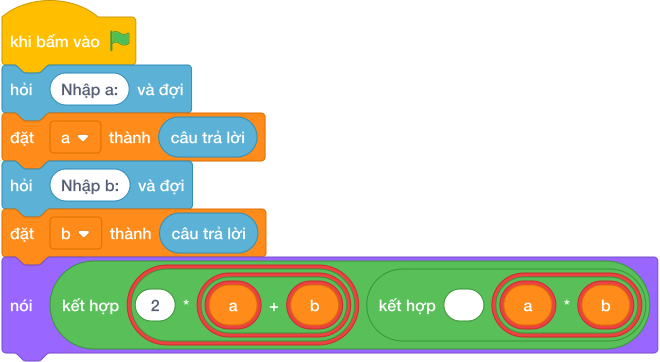

# Hướng Dẫn Giảng Dạy

## 1. Ý tưởng & Phân tích thuật toán
- Bản chất sân chữ nhật: chu vi `2 * (a + b)` và diện tích `a * b`, cả hai số `a` và `b` nằm trên cùng một dòng.
- Quy trình trong lời giải: đọc một dòng rồi tách thành `a, b`, sau đó in `2 * (a + b)` và `a * b`; với mẫu `10 6` thì chu vi `2 * (10 + 6) = 32` và diện tích `10 * 6 = 60`.
- Xử lý biên: đề cho `B` không vượt quá `A` tới 10000, chu vi lớn nhất là 40000, diện tích lớn nhất là 100000000.

---

## 2. Bảng chạy tay trên số liệu mẫu (Dry Run Table - Sample 1: 10 6)
Với số mẫu một dòng `10 6`, chương trình phải in ra `32 60`.

| Bước | Hành động | Giá trị biến | Kết quả |
|---|---|---|---|
| 1 | Đọc `a, b` | `a = 10`, `b = 6` | dài 10 rộng 6 |
| 2 | Tính `2 * (a + b)` | `2 * 16 = 32` | chu vi 32 |
| 3 | Tính `a * b` | `10 * 6 = 60` | diện tích 60, xuất `32 60` khớp mẫu |

---

## 3. Lưu ý & Bẫy lỗi thường gặp
- Bẫy 1 — thiếu ngoặc: viết `2 * a + b` thì với mẫu ra `26` thay vì `32`; cách sửa là `2 * (a + b)`.
- Bẫy 2 — đọc hai dòng riêng: dùng hai lần `câu trả lời` thì với mẫu một dòng `10 6` dòng thứ hai bị treo chờ; cách sửa là tách một dòng bằng `split()`.
- Bẫy 3 — in xuống hai dòng: dùng hai lệnh in thì với mẫu ra hai dòng thay vì một dòng `32 60`; cách sửa là in một lần.

---

## 4. Lời giải tham khảo & Kịch bản Khối lệnh Scratch 3.0

### 4.1. Khối lệnh đồ họa trực quan (Visual Scratch Blocks)

> 💡 **Kịch bản thực hiện từng bước:**
> - khi bấm vào cờ xanh
> - hỏi [Nhập a:] và đợi
> - đặt [a] thành (câu trả lời)
> - hỏi [Nhập b:] và đợi
> - đặt [b] thành (câu trả lời)
> - nói (kết hợp 2 * a + b và ' ' và a * b)
