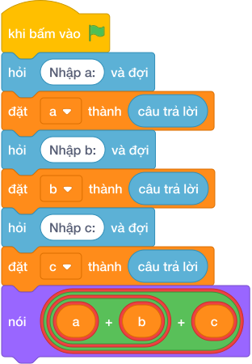

# Hướng Dẫn Giảng Dạy

## 1. Ý tưởng & Phân tích thuật toán
- Bản chất chu vi tam giác: cộng ba cạnh `a + b + c`, bài này cả ba số nằm trên cùng một dòng.
- Quy trình trong lời giải: đọc một dòng rồi tách thành `a, b, c`, sau đó in `a + b + c`; với mẫu `5 7 8` thì `5 + 7 + 8 = 20`.
- Xử lý biên: mỗi cạnh từ 1 đến 10000, tổng lớn nhất là 30000.

---

## 2. Bảng chạy tay trên số liệu mẫu (Dry Run Table - Sample 1: 5 7 8)
Với số mẫu một dòng `5 7 8`, chương trình phải in ra `20`.

| Bước | Hành động | Giá trị biến | Kết quả |
|---|---|---|---|
| 1 | Đọc `a, b, c` | `a = 5`, `b = 7`, `c = 8` | đủ ba cạnh |
| 2 | Tính `a + b + c` | `5 + 7 + 8 = 20` | chu vi 20 |
| 3 | In kết quả | xuất `20` | khớp kết quả mẫu `20` |

---

## 3. Lưu ý & Bẫy lỗi thường gặp
- Bẫy 1 — đọc ba dòng riêng: dùng ba lần `câu trả lời` thì với mẫu chỉ có một dòng `5 7 8` sẽ phải chờ thêm; cách sửa là `các khối hỏi và đợi cho từng biến` một dòng.
- Bẫy 2 — nhân thay vì cộng: viết `nói (a * b * c)` thì với mẫu ra `280` thay vì `20`; cách sửa là cộng ba cạnh.
- Bẫy 3 — quên tách chữ: viết `a = câu trả lời` thì với mẫu `5 7 8` bị lỗi đổi chữ; cách sửa là tách dòng bằng `split()`.

---

## 4. Lời giải tham khảo & Kịch bản Khối lệnh Scratch 3.0

### 4.1. Khối lệnh đồ họa trực quan (Visual Scratch Blocks)

> 💡 **Kịch bản thực hiện từng bước:**
> - khi bấm vào cờ xanh
> - hỏi [Nhập a:] và đợi
> - đặt [a] thành (câu trả lời)
> - hỏi [Nhập b:] và đợi
> - đặt [b] thành (câu trả lời)
> - hỏi [Nhập c:] và đợi
> - đặt [c] thành (câu trả lời)
> - nói (a + b + c)
