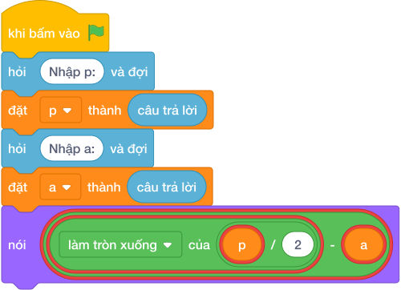

# Hướng Dẫn Giảng Dạy

## 1. Ý tưởng & Phân tích thuật toán
- Bản chất hình chữ nhật: nửa chu vi bằng `làm tròn xuống của (P / 2)`, cạnh còn lại bằng nửa chu vi trừ cạnh đã biết `a`.
- Quy trình trong lời giải: đọc `p` ở dòng 1 và `a` ở dòng 2, rồi in `làm tròn xuống của (p / 2) - a`; với mẫu `P = 30` và `a = 5` thì nửa chu vi `làm tròn xuống của (30 / 2) = 15` và cạnh còn lại `15 - 5 = 10`.
- Xử lý biên: đề cho `P` là số chẵn và `a` nhỏ hơn `làm tròn xuống của (P / 2)` nên kết quả luôn là số tự nhiên dương.

---

## 2. Bảng chạy tay trên số liệu mẫu (Dry Run Table - Sample 1: 30\n5)
Với số mẫu dòng 1 là `30` và dòng 2 là `5`, chương trình phải in ra `10`.

| Bước | Hành động | Giá trị biến | Kết quả |
|---|---|---|---|
| 1 | Đọc `p = câu trả lời` | `p = 30` | chu vi 30 |
| 2 | Đọc `a = câu trả lời` | `a = 5` | cạnh biết 5 |
| 3 | Tính `làm tròn xuống của (p / 2)` | `làm tròn xuống của (30 / 2) = 15` | nửa chu vi 15 |
| 4 | Tính `15 - 5` | `10` | khớp kết quả mẫu `10` |

---

## 3. Lưu ý & Bẫy lỗi thường gặp
- Bẫy 1 — đọc hai số một dòng: viết `p, a = các khối hỏi và đợi cho từng biến` thì với mẫu mỗi số một dòng sẽ bị lỗi thiếu số; cách sửa là đọc hai lần `câu trả lời` riêng.
- Bẫy 2 — quên chia đôi chu vi: viết `nói (p - a)` thì với mẫu ra `25` thay vì `10`; cách sửa là `làm tròn xuống của (p / 2) - a`.
- Bẫy 3 — dùng chia thực: viết `nói (p / 2 - a)` thì với mẫu in ra `10.0` thay vì `10`; cách sửa là dùng chia nguyên `//`.

---

## 4. Lời giải tham khảo & Kịch bản Khối lệnh Scratch 3.0

### 4.1. Khối lệnh đồ họa trực quan (Visual Scratch Blocks)

> 💡 **Kịch bản thực hiện từng bước:**
> - khi bấm vào cờ xanh
> - hỏi [Nhập p:] và đợi
> - đặt [p] thành (câu trả lời)
> - hỏi [Nhập a:] và đợi
> - đặt [a] thành (câu trả lời)
> - nói (p chia nguyên 2 - a)
