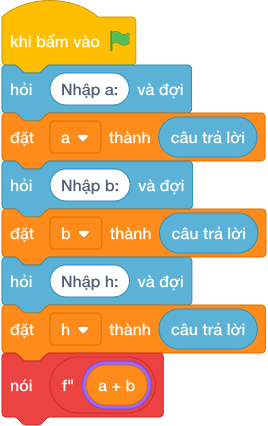

# Hướng Dẫn Giảng Dạy: Diện tích hình thang
Chuyên đề: **Lập Trình Thuật Toán & Khối Lệnh Scratch 3.0**

---

## 1. Ý tưởng & Phân tích thuật toán
- Bản chất diện tích hình thang: trung bình hai đáy nhân chiều cao, tức `((a + b) * h) / 2`, in đúng 1 chữ số thập phân.
- Quy trình trong lời giải: đọc một dòng rồi tách thành `a, b, h`, sau đó in `((a + b) * h) / 2` với 1 chữ số thập phân; với mẫu `12 8 5` thì `12 + 8 = 20`, `20 * 5 = 100`, `100 / 2 = 50.0`.
- Xử lý biên: đề cho đáy nhỏ `B` không vượt quá đáy lớn `A` tới 10000, chiều cao tới 10000.

---

## 2. Bảng chạy tay trên số liệu mẫu (Dry Run Table - Sample 1: 12 8 5)
Với số mẫu một dòng `12 8 5`, chương trình phải in ra `50.0`.

| Bước | Hành động | Giá trị biến | Kết quả |
|---|---|---|---|
| 1 | Đọc `a, b, h` | `a = 12`, `b = 8`, `h = 5` | đủ ba số |
| 2 | Tính `a + b` | `12 + 8 = 20` | tổng hai đáy 20 |
| 3 | Tính `(20 * 5) / 2` | `100 / 2 = 50.0` | khớp kết quả mẫu `50.0` |

---

## 3. Lưu ý & Bẫy lỗi thường gặp
- Bẫy 1 — thiếu ngoặc: viết `a + b * h / 2` thì với mẫu ra `32.0` thay vì `50.0`; cách sửa là `((a + b) * h) / 2`.
- Bẫy 2 — dùng chia nguyên: viết `((a + b) * h) // 2` thì với mẫu ra `50` thiếu `.0`; cách sửa là chia thực và giữ 1 chữ số thập phân.
- Bẫy 3 — đọc ba dòng riêng: dùng ba lần `câu trả lời` thì với mẫu một dòng sẽ bị treo chờ; cách sửa là tách một dòng bằng `split()`.

---

## 4. Lời giải tham khảo & Kịch bản Khối lệnh Scratch 3.0

### 4.1. Khối lệnh đồ họa trực quan (Visual Scratch Blocks)

> 💡 **Kịch bản thực hiện từng bước:**
> - khi bấm vào cờ xanh
> - hỏi [Nhập a:] và đợi
> - đặt [a] thành (câu trả lời)
> - hỏi [Nhập b:] và đợi
> - đặt [b] thành (câu trả lời)
> - hỏi [Nhập h:] và đợi
> - đặt [h] thành (câu trả lời)
> - nói (f"{((a + b)
