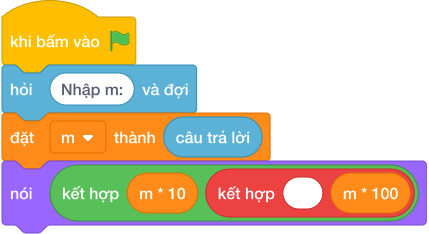

# Hướng Dẫn Giảng Dạy: Đổi mét sang centimet và milimet
Chuyên đề: **Lập Trình Thuật Toán & Khối Lệnh Scratch 3.0**

---

## 1. Ý tưởng & Phân tích thuật toán
- Bản chất đổi đơn vị dài: 1 mét bằng 100 xen-ti-mét và bằng 1000 mi-li-mét, nên từ `m` mét tính `m * 100` và `m * 1000`.
- Quy trình trong lời giải: đọc biến `m` bằng `int(câu trả lời)`, rồi in `m * 100` và `m * 1000`; với mẫu `m = 3` thì `3 * 100 = 300` và `3 * 1000 = 3000`.
- Xử lý biên: `M` nhỏ nhất là 1 cho ra `100 1000`, `M` lớn nhất là 1000 cho ra `100000 1000000`, đều là số nguyên.

---

## 2. Bảng chạy tay trên số liệu mẫu (Dry Run Table - Sample 1: 3)
Với số mẫu `3`, chương trình phải in ra `300 3000`.

| Bước | Hành động | Giá trị biến | Kết quả |
|---|---|---|---|
| 1 | Đọc `m = int(câu trả lời)` | `m = 3` | 3 mét |
| 2 | Tính `m * 100` | `3 * 100 = 300` | 300 xen-ti-mét |
| 3 | Tính `m * 1000` | `3 * 1000 = 3000` | 3000 mi-li-mét |
| 4 | In kết quả | xuất `300 3000` | khớp kết quả mẫu `300 3000` |

---

## 3. Lưu ý & Bẫy lỗi thường gặp
- Bẫy 1 — nhầm hệ số: viết `nói (m * 10, m * 100)` thì với mẫu in ra `30 300` thay vì `300 3000`; cách sửa là nhân đúng 100 và 1000.
- Bẫy 2 — đọc hai số: viết `m, n = map(int, câu trả lời.split())` thì với mẫu chỉ có một số `3` sẽ bị lỗi thiếu số; cách sửa là chỉ đọc một số `m`.
- Bẫy 3 — in xuống hai dòng: dùng hai lệnh in thì với mẫu ra hai dòng thay vì một dòng `300 3000`; cách sửa là in một lần trên cùng một dòng.

---

## 4. Lời giải tham khảo & Kịch bản Khối lệnh Scratch 3.0

### 4.1. Khối lệnh đồ họa trực quan (Visual Scratch Blocks)

> 💡 **Kịch bản thực hiện từng bước:**
> - khi bấm vào cờ xanh
> - hỏi [Nhập m:] và đợi
> - đặt [m] thành (câu trả lời)
> - nói (kết hợp m * 10 và " " và m * 100)
