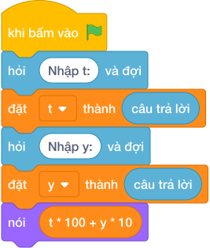

# Hướng Dẫn Giảng Dạy: Đổi tạ và yến sang kilogram
Chuyên đề: **Lập Trình Thuật Toán & Khối Lệnh Scratch 3.0**

---

## 1. Ý tưởng & Phân tích thuật toán
- Bản chất đổi khối lượng: 1 tạ bằng 100 ki-lô-gam và 1 yến bằng 10 ki-lô-gam, nên tổng là `t * 100 + y * 10`.
- Quy trình trong lời giải: đọc một dòng rồi tách thành `t, y`, sau đó in `t * 100 + y * 10`; với mẫu `5 3` thì `5 * 100 = 500`, `3 * 10 = 30`, tổng `500 + 30 = 530`.
- Xử lý biên: `T` và `Y` từ 0 đến 1000, tổng nhỏ nhất là 0, lớn nhất là 110000.

---

## 2. Bảng chạy tay trên số liệu mẫu (Dry Run Table - Sample 1: 5 3)
Với số mẫu một dòng `5 3`, chương trình phải in ra `530`.

| Bước | Hành động | Giá trị biến | Kết quả |
|---|---|---|---|
| 1 | Đọc `t, y` | `t = 5`, `y = 3` | 5 tạ 3 yến |
| 2 | Tính `t * 100` | `5 * 100 = 500` | 500 ki-lô-gam |
| 3 | Tính `500 + y * 10` | `500 + 30 = 530` | khớp kết quả mẫu `530` |

---

## 3. Lưu ý & Bẫy lỗi thường gặp
- Bẫy 1 — nhầm hệ số yến: viết `t * 100 + y * 100` thì với mẫu ra `800` thay vì `530`; cách sửa là yến nhân 10.
- Bẫy 2 — đọc hai dòng riêng: dùng hai lần `câu trả lời` thì với mẫu một dòng `5 3` sẽ bị treo chờ; cách sửa là tách một dòng bằng `split()`.
- Bẫy 3 — nhầm thành gam: viết `t * 1000 + y * 100` thì với mẫu ra số rất lớn thay vì `530`; cách sửa là nhân đúng 100 và 10.

---

## 4. Lời giải tham khảo & Kịch bản Khối lệnh Scratch 3.0

### 4.1. Khối lệnh đồ họa trực quan (Visual Scratch Blocks)

> 💡 **Kịch bản thực hiện từng bước:**
> - khi bấm vào cờ xanh
> - hỏi [Nhập t:] và đợi
> - đặt [t] thành (câu trả lời)
> - hỏi [Nhập y:] và đợi
> - đặt [y] thành (câu trả lời)
> - nói (t * 100 + y * 10)
