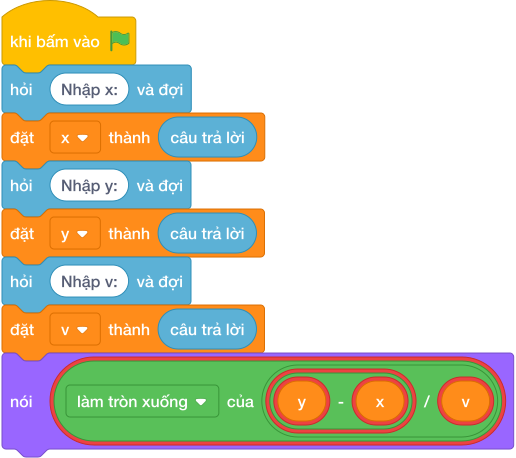

# Hướng Dẫn Giảng Dạy

## 1. Ý tưởng & Phân tích thuật toán
- Bản chất chuyển động: quãng đường Thuận phải đi là `y - x`, thời gian bằng quãng đường chia vận tốc `v`.
- Quy trình trong lời giải: đọc `x`, `y`, `v` mỗi biến một dòng, rồi in `(y - x) // v`; với mẫu `x = 10`, `y = 70`, `v = 15` thì `70 - 10 = 60` và `làm tròn xuống của (60 / 15) = 4`.
- Xử lý biên: đề đảm bảo `x` nhỏ hơn `y` và hiệu `y - x` chia hết cho `v`, nên chia nguyên cho kết quả đúng; tọa độ tới 1000000000.

---

## 2. Bảng chạy tay trên số liệu mẫu (Dry Run Table - Sample 1: 10\n70\n15)
Với số mẫu ba dòng `10`, `70`, `15`, chương trình phải in ra `4`.

| Bước | Hành động | Giá trị biến | Kết quả |
|---|---|---|---|
| 1 | Đọc `x`, `y`, `v` | `x = 10`, `y = 70`, `v = 15` | đủ ba số |
| 2 | Tính `y - x` | `70 - 10 = 60` | quãng đường 60 |
| 3 | Tính `làm tròn xuống của (60 / 15)` | `4` | khớp kết quả mẫu `4` |

---

## 3. Lưu ý & Bẫy lỗi thường gặp
- Bẫy 1 — trừ ngược: viết `nói ((x - y) // v)` thì với mẫu ra số âm thay vì `4`; cách sửa là `y - x`.
- Bẫy 2 — đọc ba số một dòng: viết `x, y, v = các khối hỏi và đợi cho từng biến` thì với mẫu mỗi số một dòng sẽ bị lỗi; cách sửa là đọc ba lần riêng.
- Bẫy 3 — dùng chia thực: viết `nói ((y - x) / v)` thì với mẫu in ra `4.0` thay vì `4`; cách sửa là dùng chia nguyên `//`.

---

## 4. Lời giải tham khảo & Kịch bản Khối lệnh Scratch 3.0

### 4.1. Khối lệnh đồ họa trực quan (Visual Scratch Blocks)

> 💡 **Kịch bản thực hiện từng bước:**
> - khi bấm vào cờ xanh
> - hỏi [Nhập x:] và đợi
> - đặt [x] thành (câu trả lời)
> - hỏi [Nhập y:] và đợi
> - đặt [y] thành (câu trả lời)
> - hỏi [Nhập v:] và đợi
> - đặt [v] thành (câu trả lời)
> - nói (y - x chia nguyên v)
