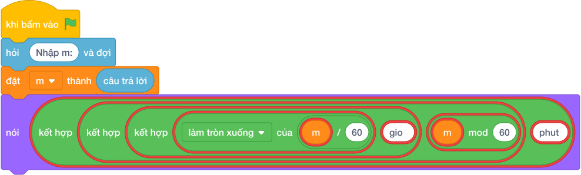

# Hướng Dẫn Giảng Dạy

## 1. Ý tưởng & Phân tích thuật toán
- Bản chất đổi phút: số giờ bằng `làm tròn xuống của (m / 60)`, số phút lẻ bằng `(m mod 60)`, rồi in theo mẫu `X gio Y phut`.
- Quy trình trong lời giải: đọc biến `m`, rồi in chuỗi ghép `làm tròn xuống của (m / 60)` và `(m mod 60)`; với mẫu `m = 135` thì `làm tròn xuống của (135 / 60) = 2` và `(135 mod 60) = 15` nên ra `2 gio 15 phut`.
- Xử lý biên: `M` nhỏ nhất là 1 cho ra `0 gio 1 phut`, `M` lớn nhất là 1000000 cho ra `16666 gio 40 phut`.

---

## 2. Bảng chạy tay trên số liệu mẫu (Dry Run Table - Sample 1: 135)
Với số mẫu `135`, chương trình phải in ra `2 gio 15 phut`.

| Bước | Hành động | Giá trị biến | Kết quả |
|---|---|---|---|
| 1 | Đọc `m = câu trả lời` | `m = 135` | 135 phút |
| 2 | Tính `làm tròn xuống của (m / 60)` | `làm tròn xuống của (135 / 60) = 2` | 2 giờ |
| 3 | Tính `(m mod 60)` | `(135 mod 60) = 15` | lẻ 15 phút, xuất `2 gio 15 phut` khớp mẫu |

---

## 3. Lưu ý & Bẫy lỗi thường gặp
- Bẫy 1 — dùng chia thực: viết `m / 60` thì với mẫu ra `2.25` thay vì `2 gio 15 phut`; cách sửa là dùng `//` và `%`.
- Bẫy 2 — sai chữ in: viết `2 giờ 15 phút` có dấu thì chương trình kiểm tra không nhận; cách sửa là in đúng `gio` và `phut` không dấu.
- Bẫy 3 — quên ép kiểu: viết `m = câu trả lời` thì `làm tròn xuống của (m / 60)` bị lỗi vì chuỗi không chia được; cách sửa là `câu trả lời`.

---

## 4. Lời giải tham khảo & Kịch bản Khối lệnh Scratch 3.0

### 4.1. Khối lệnh đồ họa trực quan (Visual Scratch Blocks)

> 💡 **Kịch bản thực hiện từng bước:**
> - khi bấm vào cờ xanh
> - hỏi [Nhập m:] và đợi
> - đặt [m] thành (câu trả lời)
> - nói (giá trị)
