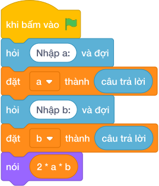

# Hướng Dẫn Giảng Dạy: Diện tích bồn hoa chữ thập
Chuyên đề: **Lập Trình Thuật Toán & Khối Lệnh Scratch 3.0**

---

## 1. Ý tưởng & Phân tích thuật toán
- Bản chất bồn hoa chữ thập: hai luống `a * b` cộng lại rồi trừ phần giao nhau `b * b`, tức `2 * a * b - b * b`.
- Quy trình trong lời giải: đọc `a` dòng 1 và `b` dòng 2, rồi in `2 * a * b - b * b`; với mẫu `a = 10` và `b = 3` thì `2 * 10 * 3 = 60`, `3 * 3 = 9`, `60 - 9 = 51`.
- Xử lý biên: đề cho `b` không vượt quá `a`, cả hai tới 10000, diện tích lớn nhất gần 200000000.

---

## 2. Bảng chạy tay trên số liệu mẫu (Dry Run Table - Sample 1: 10\n3)
Với số mẫu dòng 1 là `10` và dòng 2 là `3`, chương trình phải in ra `51`.

| Bước | Hành động | Giá trị biến | Kết quả |
|---|---|---|---|
| 1 | Đọc `a` | `a = 10` | dài 10 |
| 2 | Đọc `b` | `b = 3` | rộng 3 |
| 3 | Tính `2 * a * b` | `2 * 10 * 3 = 60` | tổng hai luống 60 |
| 4 | Tính `60 - b * b` | `60 - 9 = 51` | khớp kết quả mẫu `51` |

---

## 3. Lưu ý & Bẫy lỗi thường gặp
- Bẫy 1 — quên trừ phần giao: viết `nói (2 * a * b)` thì với mẫu ra `60` thay vì `51`; cách sửa là trừ thêm `b * b`.
- Bẫy 2 — trừ hai lần phần giao: viết `nói (2 * a * b - 2 * b * b)` thì với mẫu ra `42` thay vì `51`; cách sửa là chỉ trừ một lần `b * b`.
- Bẫy 3 — đọc hai số một dòng: viết `a, b = map(int, câu trả lời.split())` thì với mẫu mỗi số một dòng sẽ bị lỗi; cách sửa là đọc hai lần riêng.

---

## 4. Lời giải tham khảo & Kịch bản Khối lệnh Scratch 3.0

### 4.1. Khối lệnh đồ họa trực quan (Visual Scratch Blocks)

> 💡 **Kịch bản thực hiện từng bước:**
> - khi bấm vào cờ xanh
> - hỏi [Nhập a:] và đợi
> - đặt [a] thành (câu trả lời)
> - hỏi [Nhập b:] và đợi
> - đặt [b] thành (câu trả lời)
> - nói (2 * a * b)
