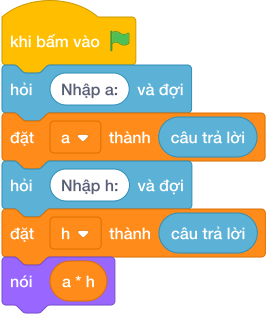

# Hướng Dẫn Giảng Dạy: Diện tích tam giác vuông
Chuyên đề: **Lập Trình Thuật Toán & Khối Lệnh Scratch 3.0**

---

## 1. Ý tưởng & Phân tích thuật toán
- Bản chất diện tích tam giác vuông: bằng nửa tích hai cạnh góc vuông, tức `a * h // 2`, đề đảm bảo tích chia hết cho 2.
- Quy trình trong lời giải: đọc `a` dòng 1 và `h` dòng 2, rồi in `a * h // 2`; với mẫu `a = 6` và `h = 4` thì `6 * 4 = 24` rồi `24 // 2 = 12`.
- Xử lý biên: `a` và `h` đều từ 1 đến 1000, tích lớn nhất `1000 * 1000 = 1000000` chia 2 được 500000.

---

## 2. Bảng chạy tay trên số liệu mẫu (Dry Run Table - Sample 1: 6\n4)
Với số mẫu dòng 1 là `6` và dòng 2 là `4`, chương trình phải in ra `12`.

| Bước | Hành động | Giá trị biến | Kết quả |
|---|---|---|---|
| 1 | Đọc `a = int(câu trả lời)` | `a = 6` | cạnh 6 |
| 2 | Đọc `h = int(câu trả lời)` | `h = 4` | cạnh 4 |
| 3 | Tính `a * h` | `6 * 4 = 24` | tích 24 |
| 4 | Tính `24 // 2` | `12` | khớp kết quả mẫu `12` |

---

## 3. Lưu ý & Bẫy lỗi thường gặp
- Bẫy 1 — quên chia 2: viết `nói (a * h)` thì với mẫu ra `24` thay vì `12`; cách sửa là chia nguyên cho 2.
- Bẫy 2 — đọc hai số một dòng: viết `a, h = map(int, câu trả lời.split())` thì với mẫu mỗi số một dòng sẽ bị lỗi; cách sửa là đọc hai lần riêng.
- Bẫy 3 — dùng chia thực: viết `nói (a * h / 2)` thì với mẫu in ra `12.0` thay vì `12`; cách sửa là dùng `//` vì đề đảm bảo chia hết.

---

## 4. Lời giải tham khảo & Kịch bản Khối lệnh Scratch 3.0

### 4.1. Khối lệnh đồ họa trực quan (Visual Scratch Blocks)

> 💡 **Kịch bản thực hiện từng bước:**
> - khi bấm vào cờ xanh
> - hỏi [Nhập a:] và đợi
> - đặt [a] thành (câu trả lời)
> - hỏi [Nhập h:] và đợi
> - đặt [h] thành (câu trả lời)
> - nói (a * h)
