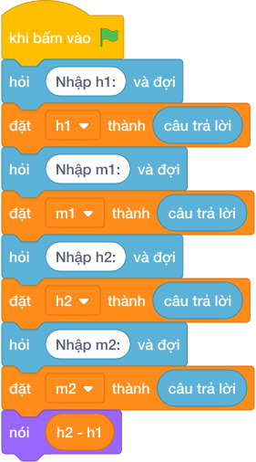

# Hướng Dẫn Giảng Dạy: Khoảng thời gian giữa hai thời điểm trong ngày
Chuyên đề: **Lập Trình Thuật Toán & Khối Lệnh Scratch 3.0**

---

## 1. Ý tưởng & Phân tích thuật toán
- Bản chất khoảng cách thời gian: đổi mỗi thời điểm về phút rồi trừ nhau, tức `(h2 * 60 + m2) - (h1 * 60 + m1)`.
- Quy trình trong lời giải: đọc một dòng rồi tách thành `h1, m1, h2, m2`, đặt `t1 = h1 * 60 + m1` và `t2 = h2 * 60 + m2` rồi in `t2 - t1`; với mẫu `8 30 10 15` thì `t1 = 8 * 60 + 30 = 510`, `t2 = 10 * 60 + 15 = 615`, hiệu `615 - 510 = 105`.
- Xử lý biên: đề cho thời điểm sau không sớm hơn thời điểm trước trong cùng một ngày, hiệu nhỏ nhất là 0.

---

## 2. Bảng chạy tay trên số liệu mẫu (Dry Run Table - Sample 1: 8 30 10 15)
Với số mẫu một dòng `8 30 10 15`, chương trình phải in ra `105`.

| Bước | Hành động | Giá trị biến | Kết quả |
|---|---|---|---|
| 1 | Đọc `h1, m1, h2, m2` | `8, 30, 10, 15` | đủ bốn số |
| 2 | Tính `t1 = 8 * 60 + 30` | `t1 = 510` | bắt đầu phút 510 |
| 3 | Tính `t2 = 10 * 60 + 15` | `t2 = 615` | kết thúc phút 615 |
| 4 | Tính `615 - 510` | `105` | khớp kết quả mẫu `105` |

---

## 3. Lưu ý & Bẫy lỗi thường gặp
- Bẫy 1 — chỉ trừ giờ: viết `nói (h2 - h1)` thì với mẫu `8 30 10 15` ra `2` thay vì `105`; cách sửa là đổi cả hai thời điểm về phút `t1 = 510`, `t2 = 615` rồi trừ `t2 - t1`.
- Bẫy 2 — trừ ngược: viết `nói (t1 - t2)` thì với mẫu ra `-105` thay vì `105`; cách sửa là lấy thời điểm sau trừ thời điểm trước.
- Bẫy 3 — đọc bốn dòng riêng: dùng bốn lần `câu trả lời` thì với mẫu một dòng sẽ bị treo chờ; cách sửa là tách một dòng bằng `split()`.

---

## 4. Lời giải tham khảo & Kịch bản Khối lệnh Scratch 3.0

### 4.1. Khối lệnh đồ họa trực quan (Visual Scratch Blocks)

> 💡 **Kịch bản thực hiện từng bước:**
> - khi bấm vào cờ xanh
> - hỏi [Nhập h1:] và đợi
> - đặt [h1] thành (câu trả lời)
> - hỏi [Nhập m1:] và đợi
> - đặt [m1] thành (câu trả lời)
> - hỏi [Nhập h2:] và đợi
> - đặt [h2] thành (câu trả lời)
> - hỏi [Nhập m2:] và đợi
> - đặt [m2] thành (câu trả lời)
> - nói (h2 - h1)
