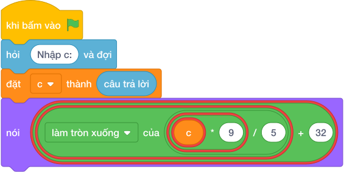

# Hướng Dẫn Giảng Dạy

## 1. Ý tưởng & Phân tích thuật toán
- Bản chất đổi nhiệt độ: độ F bằng `C * làm tròn xuống của (9 / 5) + 32`, đề bài đảm bảo `C` chia hết cho 5 nên phép chia nguyên cho kết quả đúng.
- Quy trình trong lời giải: đọc biến `c` bằng `câu trả lời`, rồi in `c * làm tròn xuống của (9 / 5) + 32`; với mẫu `c = 30` thì `30 * 9 = 270`, `làm tròn xuống của (270 / 5) = 54`, `54 + 32 = 86`.
- Xử lý biên: `C` nhỏ nhất là -50 cho ra -58 độ F, `C` lớn nhất là 50 cho ra 122 độ F; chú ý số âm vẫn tính đúng vì chia hết cho 5.

---

## 2. Bảng chạy tay trên số liệu mẫu (Dry Run Table - Sample 1: 30)
Với số mẫu `30`, chương trình phải in ra `86`.

| Bước | Hành động | Giá trị biến | Kết quả |
|---|---|---|---|
| 1 | Đọc `c = câu trả lời` | `c = 30` | 30 độ C |
| 2 | Tính `c * 9` | `30 * 9 = 270` | số 270 |
| 3 | Tính `làm tròn xuống của (270 / 5) + 32` | `54 + 32 = 86` | 86 độ F |
| 4 | In kết quả | xuất `86` | khớp kết quả mẫu `86` |

---

## 3. Lưu ý & Bẫy lỗi thường gặp
- Bẫy 1 — sai thứ tự cộng: viết `c * (làm tròn xuống của (9 / 5) + 32)` thì với mẫu `làm tròn xuống của (9 / 5) = 1` nên ra `30 * 33 = 990` thay vì `86`; cách sửa là viết `c * làm tròn xuống của (9 / 5) + 32`.
- Bẫy 2 — dùng chia thực rồi quên làm tròn: viết `c * 9 / 5 + 32` có thể in ra `86.0` thay vì `86`; cách sửa là dùng chia nguyên `//` vì đề đảm bảo chia hết.
- Bẫy 3 — quên cộng 32: viết `nói (c * làm tròn xuống của (9 / 5))` thì với mẫu ra `54` thay vì `86`; cách sửa là cộng thêm 32.

---

## 4. Lời giải tham khảo & Kịch bản Khối lệnh Scratch 3.0

### 4.1. Khối lệnh đồ họa trực quan (Visual Scratch Blocks)

> 💡 **Kịch bản thực hiện từng bước:**
> - khi bấm vào cờ xanh
> - hỏi [Nhập c:] và đợi
> - đặt [c] thành (câu trả lời)
> - nói (c * 9 chia nguyên 5 + 32)
