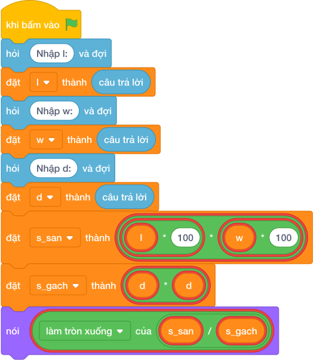

# Hướng Dẫn Giảng Dạy

## 1. Ý tưởng & Phân tích thuật toán
- Bản chất lát nền khác đơn vị: đổi dài rộng từ mét sang xen-ti-mét (`l * 100`, `w * 100`), diện tích sàn chia diện tích viên `d * d`.
- Quy trình trong lời giải: đọc một dòng rồi tách thành `l, w, d`, đặt `s_san = (l * 100) * (w * 100)` và `s_gach = d * d` rồi in `làm tròn xuống của (s_san / s_gach)`; với mẫu `6 4 50` thì sàn `600 * 400 = 240000`, viên `50 * 50 = 2500`, số gạch `làm tròn xuống của (240000 / 2500) = 96`.
- Xử lý biên: đề cho phòng vừa khít gạch nên chia hết; `L` và `W` tới 100, `D` từ 10 đến 100.

---

## 2. Bảng chạy tay trên số liệu mẫu (Dry Run Table - Sample 1: 6 4 50)
Với số mẫu một dòng `6 4 50`, chương trình phải in ra `96`.

| Bước | Hành động | Giá trị biến | Kết quả |
|---|---|---|---|
| 1 | Đọc `l, w, d` | `l = 6`, `w = 4`, `d = 50` | đủ ba số |
| 2 | Tính `s_san` | `600 * 400 = 240000` | diện tích sàn 240000 |
| 3 | Tính `s_gach` | `50 * 50 = 2500` | diện tích viên 2500 |
| 4 | Tính `làm tròn xuống của (240000 / 2500)` | `96` | khớp kết quả mẫu `96` |

---

## 3. Lưu ý & Bẫy lỗi thường gặp
- Bẫy 1 — quên đổi mét sang xen-ti-mét: viết `(l * w) // (d * d)` thì với mẫu ra `0` thay vì `96`; cách sửa là nhân `l * 100` và `w * 100` trước.
- Bẫy 2 — chỉ đổi một chiều: viết `(l * 100 * w) // (d * d)` thì với mẫu ra `0` thay vì `96`; cách sửa là đổi cả hai chiều dài và rộng.
- Bẫy 3 — dùng chia thực: viết `nói (s_san / s_gach)` thì với mẫu in ra `96.0` thay vì `96`; cách sửa là dùng chia nguyên `//`.

---

## 4. Lời giải tham khảo & Kịch bản Khối lệnh Scratch 3.0

### 4.1. Khối lệnh đồ họa trực quan (Visual Scratch Blocks)

> 💡 **Kịch bản thực hiện từng bước:**
> - khi bấm vào cờ xanh
> - hỏi [Nhập l:] và đợi
> - đặt [l] thành (câu trả lời)
> - hỏi [Nhập w:] và đợi
> - đặt [w] thành (câu trả lời)
> - hỏi [Nhập d:] và đợi
> - đặt [d] thành (câu trả lời)
> - đặt [s_san] thành (l * 100 * w * 100)
> - đặt [s_gach] thành (d * d)
> - nói (s_san chia nguyên s_gach)
