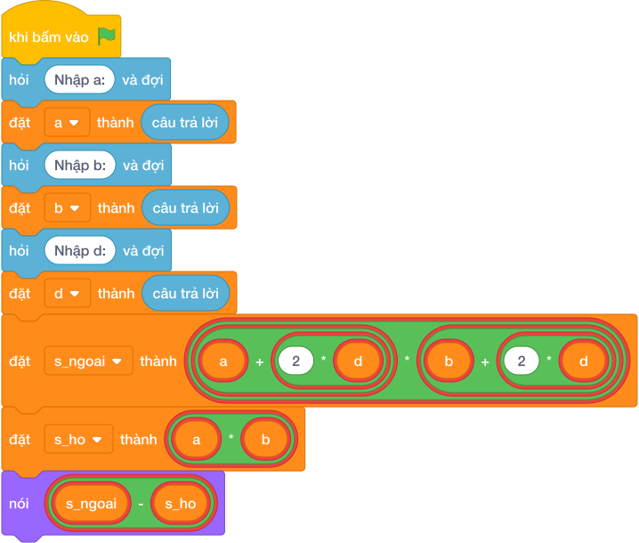

# Hướng Dẫn Giảng Dạy

## 1. Ý tưởng & Phân tích thuật toán
- Bản chất lối đi quanh hồ: diện tích ngoài `(a + 2 * d) * (b + 2 * d)` trừ diện tích hồ `a * b`.
- Quy trình trong lời giải: đọc một dòng rồi tách thành `a, b, d`, đặt `s_ngoai` và `s_ho` rồi in hiệu; với mẫu `10 8 2` thì ngoài `(10 + 4) * (8 + 4) = 14 * 12 = 168`, hồ `10 * 8 = 80`, lối đi `168 - 80 = 88`.
- Xử lý biên: `A` và `B` tới 10000, `D` tới 100, diện tích lối đi luôn dương.

---

## 2. Bảng chạy tay trên số liệu mẫu (Dry Run Table - Sample 1: 10 8 2)
Với số mẫu một dòng `10 8 2`, chương trình phải in ra `88`.

| Bước | Hành động | Giá trị biến | Kết quả |
|---|---|---|---|
| 1 | Đọc `a, b, d` | `a = 10`, `b = 8`, `d = 2` | đủ ba số |
| 2 | Tính `s_ngoai` | `14 * 12 = 168` | toàn phần 168 |
| 3 | Tính `s_ho` | `10 * 8 = 80` | hồ 80 |
| 4 | Tính `168 - 80` | `88` | khớp kết quả mẫu `88` |

---

## 3. Lưu ý & Bẫy lỗi thường gặp
- Bẫy 1 — chỉ cộng một lần bề rộng: viết `(a + d) * (b + d) - a * b` thì với mẫu ra `34` thay vì `88`; cách sửa là cộng `2 * d` mỗi chiều vì lối đi bao cả hai bên.
- Bẫy 2 — quên trừ hồ: viết `nói ((a + 2 * d) * (b + 2 * d))` thì với mẫu ra `168` thay vì `88`; cách sửa là trừ thêm `a * b`.
- Bẫy 3 — đọc ba dòng riêng: dùng ba lần `câu trả lời` thì với mẫu một dòng sẽ bị treo chờ; cách sửa là tách một dòng bằng `split()`.

---

## 4. Lời giải tham khảo & Kịch bản Khối lệnh Scratch 3.0

### 4.1. Khối lệnh đồ họa trực quan (Visual Scratch Blocks)

> 💡 **Kịch bản thực hiện từng bước:**
> - khi bấm vào cờ xanh
> - hỏi [Nhập a:] và đợi
> - đặt [a] thành (câu trả lời)
> - hỏi [Nhập b:] và đợi
> - đặt [b] thành (câu trả lời)
> - hỏi [Nhập d:] và đợi
> - đặt [d] thành (câu trả lời)
> - đặt [s_ngoai] thành (a + 2 * d * b + 2 * d)
> - đặt [s_ho] thành (a * b)
> - nói (s_ngoai - s_ho)
