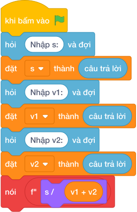

# Hướng Dẫn Giảng Dạy: Bài toán chạy bộ hai người ngược chiều
Chuyên đề: **Lập Trình Thuật Toán & Khối Lệnh Scratch 3.0**

---

## 1. Ý tưởng & Phân tích thuật toán
- Bản chất hai người chạy ngược chiều: mỗi giây khoảng cách rút ngắn `v1 + v2`, thời gian gặp nhau là `s / (v1 + v2)`.
- Quy trình trong lời giải: đọc một dòng rồi tách thành `s, v1, v2`, sau đó in `s / (v1 + v2)` với 1 chữ số thập phân; với mẫu `150 2 3` thì `2 + 3 = 5` và `150 / 5 = 30.0`.
- Xử lý biên: `S` tới 100000, mỗi vận tốc tới 100, thời gian luôn dương và in đủ 1 chữ số kể cả số tròn như `30.0`.

---

## 2. Bảng chạy tay trên số liệu mẫu (Dry Run Table - Sample 1: 150 2 3)
Với số mẫu một dòng `150 2 3`, chương trình phải in ra `30.0`.

| Bước | Hành động | Giá trị biến | Kết quả |
|---|---|---|---|
| 1 | Đọc `s, v1, v2` | `s = 150`, `v1 = 2`, `v2 = 3` | đủ ba số |
| 2 | Tính `v1 + v2` | `2 + 3 = 5` | mỗi giây gần thêm 5 |
| 3 | Tính `150 / 5` | `30.0` | khớp kết quả mẫu `30.0` |

---

## 3. Lưu ý & Bẫy lỗi thường gặp
- Bẫy 1 — thiếu ngoặc: viết `s / v1 + v2` thì với mẫu ra `78.0` thay vì `30.0`; cách sửa là `s / (v1 + v2)`.
- Bẫy 2 — dùng chia nguyên: viết `s // (v1 + v2)` thì với mẫu ra `30` thiếu `.0`; cách sửa là chia thực và giữ 1 chữ số thập phân.
- Bẫy 3 — đọc ba dòng riêng: dùng ba lần `câu trả lời` thì với mẫu một dòng sẽ bị treo chờ; cách sửa là tách một dòng bằng `split()`.

---

## 4. Lời giải tham khảo & Kịch bản Khối lệnh Scratch 3.0

### 4.1. Khối lệnh đồ họa trực quan (Visual Scratch Blocks)

> 💡 **Kịch bản thực hiện từng bước:**
> - khi bấm vào cờ xanh
> - hỏi [Nhập s:] và đợi
> - đặt [s] thành (câu trả lời)
> - hỏi [Nhập v1:] và đợi
> - đặt [v1] thành (câu trả lời)
> - hỏi [Nhập v2:] và đợi
> - đặt [v2] thành (câu trả lời)
> - nói (f"{s / (v1 + v2)
