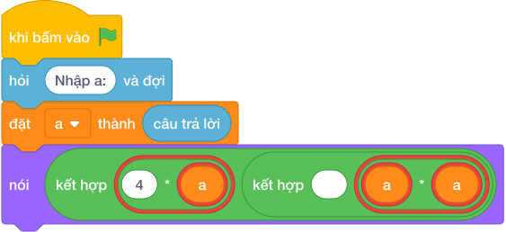

# Hướng Dẫn Giảng Dạy

## 1. Ý tưởng & Phân tích thuật toán
- Bản chất của bài này vẫn là hình vuông cạnh `a`: chu vi khung bằng `4 * a`, diện tích mặt kính bằng `a * a`.
- Quy trình trong lời giải: đọc biến `a` bằng `câu trả lời`, rồi in `4 * a` và `a * a`; với mẫu `a = 8` thì `4 * 8 = 32` và `8 * 8 = 64`.
- Xử lý biên: `a` nhỏ nhất là 1 cho ra `4 1`, `a` lớn nhất là 10000 cho ra `40000 100000000`.

---

## 2. Bảng chạy tay trên số liệu mẫu (Dry Run Table - Sample 1: 8)
Với số mẫu `8`, chương trình phải in ra `32 64`.

| Bước | Hành động | Giá trị biến | Kết quả |
|---|---|---|---|
| 1 | Đọc `a = câu trả lời` | `a = 8` | cạnh bằng 8 |
| 2 | Tính `4 * a` | `4 * 8 = 32` | chu vi 32 |
| 3 | Tính `a * a` | `8 * 8 = 64` | diện tích 64 |
| 4 | In kết quả | xuất `32 64` | khớp kết quả mẫu `32 64` |

---

## 3. Lưu ý & Bẫy lỗi thường gặp
- Bẫy 1 — chỉ in chu vi: viết `nói (4 * a)` thì với mẫu chỉ ra `32` mà thiếu `64`; cách sửa là in cả hai số `nói (4 * a, a * a)`.
- Bẫy 2 — nhầm diện tích thành `2 * a`: viết `nói (4 * a, 2 * a)` thì với mẫu ra `32 16` thay vì `32 64`; cách sửa là diện tích `a * a`.
- Bẫy 3 — quên đổi kiểu: viết `a = câu trả lời` thì `4 * a` lặp chuỗi thay vì ra `32 64`; cách sửa là bọc `câu trả lời`.

---

## 4. Lời giải tham khảo & Kịch bản Khối lệnh Scratch 3.0

### 4.1. Khối lệnh đồ họa trực quan (Visual Scratch Blocks)

> 💡 **Kịch bản thực hiện từng bước:**
> - khi bấm vào cờ xanh
> - hỏi [Nhập a:] và đợi
> - đặt [a] thành (câu trả lời)
> - nói (kết hợp 4 * a và ' ' và a * a)
