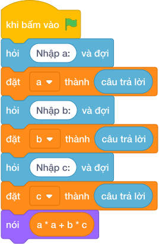

# Hướng Dẫn Giảng Dạy: Hồ cá sấu và đảo nhỏ
Chuyên đề: **Lập Trình Thuật Toán & Khối Lệnh Scratch 3.0**

---

## 1. Ý tưởng & Phân tích thuật toán
- Bản chất diện tích còn lại: diện tích hồ `a * a` trừ diện tích đảo `b * c`.
- Quy trình trong lời giải: đọc `a`, `b`, `c` mỗi biến một dòng, rồi in `a * a - b * c`; với mẫu `a = 10`, `b = 3`, `c = 4` thì hồ `10 * 10 = 100`, đảo `3 * 4 = 12`, còn lại `100 - 12 = 88`.
- Xử lý biên: đề cho `B` và `C` đều nhỏ hơn `A` tới 10000 nên mặt nước còn lại luôn dương.

---

## 2. Bảng chạy tay trên số liệu mẫu (Dry Run Table - Sample 1: 10\n3\n4)
Với số mẫu ba dòng `10`, `3`, `4`, chương trình phải in ra `88`.

| Bước | Hành động | Giá trị biến | Kết quả |
|---|---|---|---|
| 1 | Đọc `a`, `b`, `c` | `a = 10`, `b = 3`, `c = 4` | đủ ba số |
| 2 | Tính `a * a` | `10 * 10 = 100` | diện tích hồ 100 |
| 3 | Tính `b * c` | `3 * 4 = 12` | diện tích đảo 12 |
| 4 | Tính `100 - 12` | `88` | khớp kết quả mẫu `88` |

---

## 3. Lưu ý & Bẫy lỗi thường gặp
- Bẫy 1 — cộng thay vì trừ: viết `nói (a * a + b * c)` thì với mẫu ra `112` thay vì `88`; cách sửa là lấy hồ trừ đảo.
- Bẫy 2 — nhầm đảo thành hình vuông: viết `nói (a * a - b * b)` thì với mẫu ra `91` thay vì `88`; cách sửa là đảo `b * c`.
- Bẫy 3 — đọc ba số một dòng: viết `a, b, c = map(int, câu trả lời.split())` thì với mẫu mỗi số một dòng sẽ bị lỗi; cách sửa là đọc ba lần riêng.

---

## 4. Lời giải tham khảo & Kịch bản Khối lệnh Scratch 3.0

### 4.1. Khối lệnh đồ họa trực quan (Visual Scratch Blocks)

> 💡 **Kịch bản thực hiện từng bước:**
> - khi bấm vào cờ xanh
> - hỏi [Nhập a:] và đợi
> - đặt [a] thành (câu trả lời)
> - hỏi [Nhập b:] và đợi
> - đặt [b] thành (câu trả lời)
> - hỏi [Nhập c:] và đợi
> - đặt [c] thành (câu trả lời)
> - nói (a * a + b * c)
