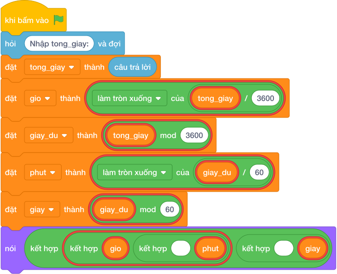

# Hướng Dẫn Giảng Dạy

## 1. Ý tưởng & Phân tích thuật toán
- Bản chất tách giây: số giờ `làm tròn xuống của (tong_giay / 3600)`, phần dư `(tong_giay mod 3600)` tách tiếp thành phút `// 60` và giây lẻ `% 60`.
- Quy trình trong lời giải: đọc `tong_giay`, đặt `gio`, `giay_du`, `phut`, `giay` rồi in ba số; với mẫu `3665` thì `làm tròn xuống của (3665 / 3600) = 1`, dư `65`, `làm tròn xuống của (65 / 60) = 1` phút, lẻ `(65 mod 60) = 5` giây nên ra `1 1 5`.
- Xử lý biên: `S` từ 0 đến 100000000, số 0 cho ra `0 0 0`, số tròn 3600 cho ra `1 0 0`.

---

## 2. Bảng chạy tay trên số liệu mẫu (Dry Run Table - Sample 1: 3665)
Với số mẫu `3665`, chương trình phải in ra `1 1 5`.

| Bước | Hành động | Giá trị biến | Kết quả |
|---|---|---|---|
| 1 | Đọc `tong_giay` | `tong_giay = 3665` | 3665 giây |
| 2 | Tính `gio`, `giay_du` | `gio = 1`, `giay_du = 65` | 1 giờ dư 65 |
| 3 | Tính `phut`, `giay` | `phut = 1`, `giay = 5` | xuất `1 1 5` khớp mẫu |

---

## 3. Lưu ý & Bẫy lỗi thường gặp
- Bẫy 1 — chia phút trực tiếp: viết `phut = làm tròn xuống của (tong_giay / 60)` thì với mẫu ra `61` thay vì `1`; cách sửa là lấy phần dư sau khi trừ giờ rồi mới chia 60.
- Bẫy 2 — in kèm dấu hai chấm: viết `nói (gio, phut, giay, sep=":")` thì với mẫu ra `1:1:5` thay vì `1 1 5`; cách sửa là in ba số cách nhau dấu cách.
- Bẫy 3 — quên ép kiểu: viết `tong_giay = câu trả lời` thì phép `//` bị lỗi vì chuỗi; cách sửa là `câu trả lời`.

---

## 4. Lời giải tham khảo & Kịch bản Khối lệnh Scratch 3.0

### 4.1. Khối lệnh đồ họa trực quan (Visual Scratch Blocks)

> 💡 **Kịch bản thực hiện từng bước:**
> - khi bấm vào cờ xanh
> - hỏi [Nhập tong_giay:] và đợi
> - đặt [tong_giay] thành (câu trả lời)
> - đặt [gio] thành (tong_giay chia nguyên 3600)
> - đặt [giay_du] thành (tong_giay mod 3600)
> - đặt [phut] thành (giay_du chia nguyên 60)
> - đặt [giay] thành (giay_du mod 60)
> - nói (kết hợp gio và ' ' và phut và ' ' và giay)
