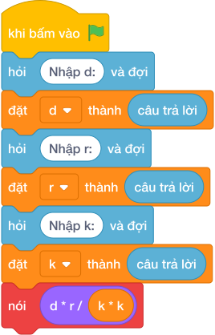

# Hướng Dẫn Giảng Dạy: Lát gạch sân trường
Chuyên đề: **Lập Trình Thuật Toán & Khối Lệnh Scratch 3.0**

---

## 1. Ý tưởng & Phân tích thuật toán
- Bản chất lát gạch: số gạch bằng diện tích sân `d * r` chia diện tích một viên `k * k`, đề đảm bảo chia hết.
- Quy trình trong lời giải: đọc `d`, `r`, `k` mỗi biến một dòng, rồi in `d * r // (k * k)`; với mẫu `d = 20`, `r = 10`, `k = 2` thì sân `20 * 10 = 200`, gạch `2 * 2 = 4`, số viên `200 // 4 = 50`.
- Xử lý biên: `K` không vượt quá `R` và `R` không vượt quá `D` tới 1000, số gạch ít nhất là 1.

---

## 2. Bảng chạy tay trên số liệu mẫu (Dry Run Table - Sample 1: 20\n10\n2)
Với số mẫu ba dòng `20`, `10`, `2`, chương trình phải in ra `50`.

| Bước | Hành động | Giá trị biến | Kết quả |
|---|---|---|---|
| 1 | Đọc `d`, `r`, `k` | `d = 20`, `r = 10`, `k = 2` | đủ ba số |
| 2 | Tính `d * r` | `20 * 10 = 200` | diện tích sân 200 |
| 3 | Tính `k * k` | `2 * 2 = 4` | diện tích viên 4 |
| 4 | Tính `200 // 4` | `50` | khớp kết quả mẫu `50` |

---

## 3. Lưu ý & Bẫy lỗi thường gặp
- Bẫy 1 — thiếu ngoặc: viết `d * r // k * k` thì với mẫu tính thành `(200 // 2) * 2 = 200` thay vì `50`; cách sửa là `d * r // (k * k)`.
- Bẫy 2 — đọc ba số một dòng: viết `d, r, k = map(int, câu trả lời.split())` thì với mẫu mỗi số một dòng sẽ bị lỗi; cách sửa là đọc ba lần riêng.
- Bẫy 3 — dùng chia thực: viết `nói (d * r / (k * k))` thì với mẫu in ra `50.0` thay vì `50`; cách sửa là dùng chia nguyên `//`.

---

## 4. Lời giải tham khảo & Kịch bản Khối lệnh Scratch 3.0

### 4.1. Khối lệnh đồ họa trực quan (Visual Scratch Blocks)

> 💡 **Kịch bản thực hiện từng bước:**
> - khi bấm vào cờ xanh
> - hỏi [Nhập d:] và đợi
> - đặt [d] thành (câu trả lời)
> - hỏi [Nhập r:] và đợi
> - đặt [r] thành (câu trả lời)
> - hỏi [Nhập k:] và đợi
> - đặt [k] thành (câu trả lời)
> - nói (d * r / (k * k)
