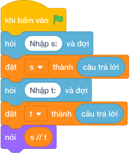

# Hướng Dẫn Giảng Dạy: Tính vận tốc trung bình
Chuyên đề: **Lập Trình Thuật Toán & Khối Lệnh Scratch 3.0**

---

## 1. Ý tưởng & Phân tích thuật toán
- Bản chất vận tốc trung bình: quãng đường `s` chia thời gian `t`, in làm tròn 2 chữ số thập phân.
- Quy trình trong lời giải: đọc một dòng rồi tách thành `s, t`, sau đó in `s / t` với 2 chữ số thập phân; với mẫu `100 3` thì `100 / 3 = 33.333...` làm tròn thành `33.33`.
- Xử lý biên: `T` từ 1 đến 100, `S` tới 100000, luôn in đủ 2 chữ số kể cả số tròn.

---

## 2. Bảng chạy tay trên số liệu mẫu (Dry Run Table - Sample 1: 100 3)
Với số mẫu một dòng `100 3`, chương trình phải in ra `33.33`.

| Bước | Hành động | Giá trị biến | Kết quả |
|---|---|---|---|
| 1 | Đọc `s, t` | `s = 100`, `t = 3` | đủ hai số |
| 2 | Tính `s / t` | `100 / 3 = 33.333...` | số dài 33.333 |
| 3 | Làm tròn 2 chữ số | `33.33` | khớp kết quả mẫu `33.33` |

---

## 3. Lưu ý & Bẫy lỗi thường gặp
- Bẫy 1 — dùng chia nguyên: viết `nói (s // t)` thì với mẫu ra `33` thay vì `33.33`; cách sửa là chia thực `s / t` rồi làm tròn 2 chữ số.
- Bẫy 2 — in thô không làm tròn: viết `nói (s / t)` thì với mẫu ra `33.333333333333336` thay vì `33.33`; cách sửa là ghi định dạng 2 chữ số thập phân.
- Bẫy 3 — đọc hai dòng riêng: dùng hai lần `câu trả lời` thì với mẫu một dòng `100 3` sẽ bị treo chờ; cách sửa là tách một dòng bằng `split()`.

---

## 4. Lời giải tham khảo & Kịch bản Khối lệnh Scratch 3.0

### 4.1. Khối lệnh đồ họa trực quan (Visual Scratch Blocks)

> 💡 **Kịch bản thực hiện từng bước:**
> - khi bấm vào cờ xanh
> - hỏi [Nhập s:] và đợi
> - đặt [s] thành (câu trả lời)
> - hỏi [Nhập t:] và đợi
> - đặt [t] thành (câu trả lời)
> - nói (s // t)
