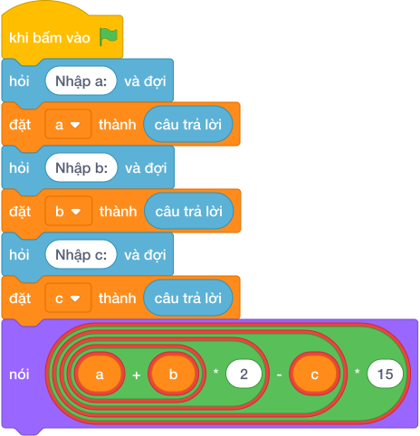

# Hướng Dẫn Giảng Dạy

## 1. Ý tưởng & Phân tích thuật toán
- Bản chất tiền rào: chu vi vườn `(a + b) * 2` trừ cửa `c` rồi nhân đơn giá 15 nghìn một mét.
- Quy trình trong lời giải: đọc `a`, `b`, `c` mỗi biến một dòng, rồi in `((a + b) * 2 - c) * 15`; với mẫu `a = 12`, `b = 8`, `c = 2` thì chu vi `(12 + 8) * 2 = 40`, rào `40 - 2 = 38`, tiền `38 * 15 = 570`.
- Xử lý biên: `a` và `b` tới 10000, `c` nhỏ hơn chu vi nên độ dài rào luôn dương.

---

## 2. Bảng chạy tay trên số liệu mẫu (Dry Run Table - Sample 1: 12\n8\n2)
Với số mẫu ba dòng `12`, `8`, `2`, chương trình phải in ra `570`.

| Bước | Hành động | Giá trị biến | Kết quả |
|---|---|---|---|
| 1 | Đọc `a`, `b`, `c` | `a = 12`, `b = 8`, `c = 2` | đủ ba số |
| 2 | Tính `(a + b) * 2` | `(12 + 8) * 2 = 40` | chu vi 40 |
| 3 | Tính `(40 - 2) * 15` | `38 * 15 = 570` | khớp kết quả mẫu `570` |

---

## 3. Lưu ý & Bẫy lỗi thường gặp
- Bẫy 1 — quên trừ cửa: viết `nói ((a + b) * 2 * 15)` thì với mẫu ra `600` thay vì `570`; cách sửa là trừ `c` trước khi nhân 15.
- Bẫy 2 — quên nhân đơn giá: viết `nói ((a + b) * 2 - c)` thì với mẫu ra `38` thay vì `570`; cách sửa là nhân thêm 15.
- Bẫy 3 — đọc ba số một dòng: viết `a, b, c = các khối hỏi và đợi cho từng biến` thì với mẫu mỗi số một dòng sẽ bị lỗi; cách sửa là đọc ba lần riêng.

---

## 4. Lời giải tham khảo & Kịch bản Khối lệnh Scratch 3.0

### 4.1. Khối lệnh đồ họa trực quan (Visual Scratch Blocks)

> 💡 **Kịch bản thực hiện từng bước:**
> - khi bấm vào cờ xanh
> - hỏi [Nhập a:] và đợi
> - đặt [a] thành (câu trả lời)
> - hỏi [Nhập b:] và đợi
> - đặt [b] thành (câu trả lời)
> - hỏi [Nhập c:] và đợi
> - đặt [c] thành (câu trả lời)
> - nói (a + b * 2 - c * 15)
