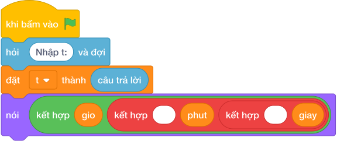

# Hướng Dẫn Giảng Dạy: Đổi tổng số giây sang giờ, phút, giây
Chuyên đề: **Lập Trình Thuật Toán & Khối Lệnh Scratch 3.0**

---

## 1. Ý tưởng & Phân tích thuật toán
- Bản chất tách giây giống bài đổi giây nhưng in theo dạng `H:M:S` với dấu hai chấm.
- Quy trình trong lời giải: đọc `t`, đặt `gio = t // 3600`, `phut = (t % 3600) // 60`, `giay = t % 60` rồi in ghép dấu hai chấm; với mẫu `3665` thì `gio = 1`, `phut = 1`, `giay = 5` nên ra `1:1:5`.
- Xử lý biên: `T` từ 1 đến 1000000000, chú ý giây lẻ lấy `% 60` của tổng, không phải của phần dư giờ? với mẫu cả hai cách đều ra 5.

---

## 2. Bảng chạy tay trên số liệu mẫu (Dry Run Table - Sample 1: 3665)
Với số mẫu `3665`, chương trình phải in ra `1:1:5`.

| Bước | Hành động | Giá trị biến | Kết quả |
|---|---|---|---|
| 1 | Đọc `t` | `t = 3665` | 3665 giây |
| 2 | Tính `gio` | `3665 // 3600 = 1` | 1 giờ |
| 3 | Tính `phut`, `giay` | `phut = 1`, `giay = 5` | xuất `1:1:5` khớp mẫu |

---

## 3. Lưu ý & Bẫy lỗi thường gặp
- Bẫy 1 — in cách nhau dấu cách: viết `nói (gio, phut, giay)` thì với mẫu ra `1 1 5` thay vì `1:1:5`; cách sửa là ghép chuỗi với dấu hai chấm.
- Bẫy 2 — chia phút trực tiếp: viết `phut = t // 60` thì với mẫu ra `61` thay vì `1`; cách sửa là `(t % 3600) // 60`.
- Bẫy 3 — quên ép kiểu: viết `t = câu trả lời` thì phép `//` bị lỗi; cách sửa là `int(câu trả lời)`.

---

## 4. Lời giải tham khảo & Kịch bản Khối lệnh Scratch 3.0

### 4.1. Khối lệnh đồ họa trực quan (Visual Scratch Blocks)

> 💡 **Kịch bản thực hiện từng bước:**
> - khi bấm vào cờ xanh
> - hỏi [Nhập t:] và đợi
> - đặt [t] thành (câu trả lời)
> - nói (kết hợp gio và " " và phut và " " và giay)
